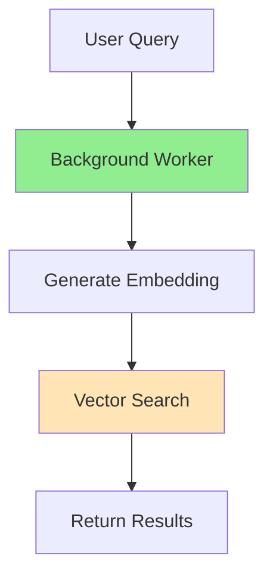

# CLAUDE.md

This file provides guidance to Claude Code (claude.ai/code) when working with code in this repository.

## Project Overview

**Contextual Recall** is a browser extension for semantic memory and activity intelligence. It captures and indexes browser activity locally, enabling users to query their history in natural language using RAG (Retrieval-Augmented Generation).

**Key Principles**:
- Local-first: All data stays on device (IndexedDB, no cloud)
- Privacy-preserving: Raw content never leaves browser
- Semantic search: Neural embeddings (all-MiniLM-L6-v2, 384-dim vectors)
- Browser-native: Chrome extension with offscreen document + Web Worker architecture

## Development Commands

### Building & Running
```bash
# Install dependencies
npm install

# Development build (watch mode)
npm run dev

# Production build
npm run build

# Run tests
npm test

# Run tests in background (ALWAYS use this per user instruction)
npm test &

# Lint code
npm run lint

# Format code
npm run format
```

### Loading Extension in Chrome
1. Build the extension: `npm run build`
2. Navigate to `chrome://extensions/`
3. Enable "Developer mode" (top right)
4. Click "Load unpacked"
5. Select the `extension/` directory

### Testing LLM Models
Open `tests/llm-benchmark.html` in Chrome to benchmark Phi-3-mini vs Gemma-2B performance (load time, inference speed, memory usage).

## Architecture Overview

### Core Architecture Pattern: Offscreen + Web Worker
The extension uses **offscreen documents** for DOM APIs and **Web Workers** for ML inference (transformers.js), as service workers lack DOM and WASM support.

**Data Flow**:
```
Page Load → Content Script → Background Service Worker
                                        ↓
                            Offscreen Document (offscreen.js)
                                        ↓
                            Web Worker (embeddings-worker.js)
                                        ↓
                            transformers.js (all-MiniLM-L6-v2)
                                        ↓
                            Generate 384-dim embedding
                                        ↓
                            Store in IndexedDB (vectordb.js)
```

**Query Flow**:
```
User Query → Sidebar UI → Background Worker
                                ↓
                    Generate query embedding
                                ↓
                    Vector search (cosine similarity)
                                ↓
                    Return top 10 results → Display
```

### Key Components

**extension/background.js**:
- Service worker (manifest v3, ESM modules)
- Coordinates content capture from all tabs
- Manages vector database (IndexedDB for POC, LanceDB WASM planned)
- Handles semantic queries from sidebar
- Initializes embeddings (via offscreen document)

**extension/offscreen.js + offscreen.html**:
- Provides DOM APIs and Web Worker support for service worker
- Creates and manages embeddings-worker.js (and future llm-worker.js)
- Bridges messages between service worker and Web Workers

**extension/lib/embeddings-worker.js**:
- Web Worker for neural embeddings using transformers.js
- Loads all-MiniLM-L6-v2 model (~50MB on first run, cached after)
- Generates 384-dimensional embeddings for text

**extension/lib/embeddings.js**:
- Bridge to offscreen document for embedding generation
- Provides `initEmbeddings()` and `generateEmbedding()` functions
- Used by background service worker

**extension/lib/vectordb.js**:
- Simple IndexedDB-based vector database (POC implementation)
- Stores page content with embeddings
- Provides cosine similarity search
- **Future**: Will be replaced by LanceDB WASM for 10GB+ storage

**extension/lib/chunker.js**:
- Semantic text chunking (DOM-based, runs in offscreen document)
- Splits pages into meaningful chunks (paragraphs, sections)
- Used during content capture

**extension/content.js**:
- Content script injected into all pages
- Captures page content (HTML, text, title, URL)
- Sends to background worker for indexing

**extension/sidepanel/sidepanel.js + sidepanel.html**:
- Sidebar UI for searching captured content
- Displays search results with titles, snippets, timestamps
- Shows statistics (pages indexed, storage used, queries today)
- Filter by time period (today, week, month, all)

### Message Passing Architecture

**Important**: The extension uses a specific message routing pattern:
- Messages with `type.startsWith('EMBEDDINGS_')` are routed to offscreen document
- Other messages (`CAPTURE_PAGE`, `QUERY`, `GET_STATS`) are handled by background service worker
- Offscreen document creates Web Workers and forwards messages to them

## Recursive Language Models (RLM) Integration

**Update (Jan 2026)**: Incorporating concepts from the Recursive Language Models paper (arxiv.org/abs/2512.24601) to enable hierarchical query decomposition over large browsing histories.

**Key Insight**: Complex queries that span multiple time periods, topics, or require multi-hop reasoning cannot be answered with simple "retrieve top 5 chunks → LLM" approach. Solution: Recursive query decomposition with token budget management.

**Implementation Phases**:
- **Phase 1**: LLM integration with token budget management (current)
- **Phase 1.5**: Recursive query handler with hierarchical decomposition (next)
- **Phase 2+**: Advanced aggregation strategies

See [Phase 1.5 Plan](docs/phase1.5-recursive-query-plan.md) for complete implementation details.

---

## Current Status (Phase 1)

### Completed ✅
- Chrome extension MVP (manifest, service worker, content script)
- Semantic search with all-MiniLM-L6-v2 embeddings (384-dim vectors)
- IndexedDB vector storage with cosine similarity search
- Offscreen + Web Worker architecture (transformers.js working)
- Content capture and chunking (DOM-based)
- Sidebar UI with search, filters, and stats dashboard

### In Progress 🚧
- **LLM Q&A integration** (Phi-3-mini or Gemma-2B) - See `docs/phase1-llm-task-plan.md`
  - Goal: Add natural language Q&A about captured content
  - Next steps: Create llm-worker.js, wire up RAG pipeline, add Q&A mode to UI

### Future Phases
- **Phase 2**: LanceDB WASM integration (10GB+ storage, <300ms queries)
- **Phase 3**: iXML grammars for structured content (75% better recall on API docs)
- **Phase 4**: Team collaboration (opt-in metadata sharing)
- **Phase 5**: Enterprise BI (anonymized aggregation)

## File Structure

```
extension/
├── manifest.json           # Chrome extension manifest (v3)
├── background.js           # Service worker (ESM modules)
├── content.js              # Content script
├── offscreen.html          # Offscreen document
├── offscreen.js            # Offscreen document script
├── lib/
│   ├── embeddings.js       # Embeddings bridge
│   ├── embeddings-worker.js # Web Worker for embeddings
│   ├── chunker.js          # Text chunking
│   ├── vectordb.js         # IndexedDB vector database
│   └── transformers/       # transformers.js library
└── sidepanel/
    ├── sidepanel.html      # Sidebar UI
    ├── sidepanel.js        # Sidebar logic
    └── sidepanel.css       # Sidebar styles

docs/
├── architecture.md         # Full system architecture
├── phase1-llm-task-plan.md # LLM integration plan (CURRENT)
├── technical-design.md     # WASM components
└── content-strategy.md     # iXML vs token chunking

tests/
└── llm-benchmark.html      # LLM model benchmarking
```

## Important Coding Guidelines

### 1. Never Break the Offscreen Architecture
- Service workers CANNOT use transformers.js directly (no WASM support)
- Always use offscreen document + Web Worker pattern for ML inference
- When adding LLM support, follow the same pattern as embeddings:
  - Create `lib/llm-worker.js` (Web Worker)
  - Create `lib/llm.js` (bridge to offscreen document)
  - Update `offscreen.js` to handle LLM messages

### 2. Message Routing Convention
- Prefix offscreen messages with feature name (e.g., `EMBEDDINGS_INIT`, `LLM_GENERATE`)
- Background worker ignores messages with known prefixes
- Include `id` field in messages for request/response matching

### 3. Async Message Handling
Always return `true` from `chrome.runtime.onMessage.addListener()` for async responses:
```javascript
chrome.runtime.onMessage.addListener((message, sender, sendResponse) => {
  if (message.type === 'ASYNC_OPERATION') {
    handleAsyncOperation(message)
      .then(result => sendResponse({ result }))
      .catch(error => sendResponse({ error: error.message }));
    return true; // REQUIRED for async
  }
});
```

### 4. IndexedDB Patterns
- Always wrap IndexedDB operations in promises
- Use transactions for multi-step operations
- Current POC uses simple cosine similarity (O(n) - scans all pages)
- Future LanceDB WASM will use HNSW index (sub-linear search)

### 5. Embeddings Best Practices
- Check `isInitialized()` before using neural embeddings
- Fall back to simple TF-IDF if embeddings fail to load
- Neural embeddings take ~5-10s to initialize on first run (model download)
- Use lower similarity threshold for neural (0.3) vs TF-IDF (0.1)

### 6. Error Handling
- Never let initialization failures crash the extension
- Log errors with context: `console.error('[Background] Failed to:', error)`
- Provide degraded functionality if components fail (e.g., TF-IDF fallback)

### 7. Testing
- Always run tests in background per user instruction: `npm test &`
- Test LLM models in `tests/llm-benchmark.html` before integration
- Benchmark performance: model load time, inference speed, memory usage

### 8. Token Budget Management (RLM-Inspired)
**Critical for Phi-3-mini's 4K context window**

**Always**:
- Create TokenBudgetManager at start of each LLM query
- Track token usage for: query, context, answer generation
- Reserve tokens for final answer (500 tokens minimum)
- Check budget before adding more context chunks

**Token Budget Allocation**:
```javascript
// Phase 1: Simple queries
const tokenBudget = new TokenBudgetManager(4096); // Total budget
tokenBudget.recordUsage(estimatedQueryTokens);
const maxChunks = tokenBudget.getMaxChunks(500); // 500 tokens per chunk

// Phase 1.5: Recursive queries
const budgetPerSub = tokenBudget.allocateForSubQueries(numSubQueries, depth);
// Exponential decay: deeper queries get less budget (0.6^depth penalty)
```

**Budget Exhaustion**:
- If budget < 500 tokens: Fall back to simple query or return cached results
- Never exceed 4K token limit - Phi-3-mini will fail
- Log budget usage for debugging: `[TokenBudget] Used X/Y tokens`

**Token Estimation**:
- Simple heuristic: 1 token ≈ 4 characters
- Use `estimateTokens(text)` function from llm.js
- Conservative estimates better than optimistic (add 10% buffer)

### 9. Recursive Query Patterns (Phase 1.5)
**When implementing recursive query decomposition**:

**Query Classification**:
- Temporal: /last (week|month|year)/, /evolution/, /timeline/
- Multi-topic: /compare/, /both/, /and/
- Multi-hop: /related to/, /documentation for/, /error.*yesterday/
- Simple: Everything else (no decomposition)

**Decomposition Rules**:
- Max depth: 3 (prevent runaway recursion)
- Parallel execution: Use `Promise.all()` for sub-queries
- Token allocation: Exponential decay by depth (0.6^depth)
- Base case: depth >= maxDepth OR budget < 500 tokens

**Aggregation Strategies**:
- Temporal: Build timeline narrative showing progression
- Multi-topic: Compare and contrast findings
- Multi-hop: Follow reasoning chain sequentially
- Always deduplicate sources by URL

**Common Mistakes**:
- ❌ DON'T create circular decomposition (query → sub-query → same query)
- ❌ DON'T allocate equal budget to all sub-queries (use decay)
- ❌ DON'T aggregate without considering query type
- ❌ DON'T lose source references during aggregation
- ✅ DO track metadata (depth, sub-queries, token usage)
- ✅ DO show sub-queries to user for transparency
- ✅ DO fall back gracefully on errors

## RAG Pipeline (Current + Future)

### Phase 1: Basic RAG (Current)
```
Query → Generate embedding → Vector search → Top 5 results
      → Build context (token budget managed)
      → LLM (Phi-3-mini) → Natural language answer
```

### Phase 1.5: Recursive RAG (Next)
```
Query → Query Classifier
         ↓
   [Complex query?]
         ↓
   Query Decomposer → [Sub-query 1, Sub-query 2, ...]
         ↓
   Allocate token budget per sub-query
         ↓
   Execute sub-queries recursively (parallel)
         ↓
   Result Aggregator → Synthesized answer with all sources
```

**Query Flow Example** (Temporal):
```
Input: "How did my EDI knowledge evolve last month?"
  ↓
Classify: Temporal query
  ↓
Decompose: [Week 1, Week 2, Week 3, Week 4]
  ↓
Execute (parallel):
  - Week 1: Retrieve + Answer (budget: 700 tokens)
  - Week 2: Retrieve + Answer (budget: 700 tokens)
  - Week 3: Retrieve + Answer (budget: 700 tokens)
  - Week 4: Retrieve + Answer (budget: 700 tokens)
  ↓
Aggregate: "In week 1 you learned ISA basics... By week 4 you mastered loops..."
  ↓
Return: Timeline narrative + all sources (deduplicated)
```

See:
- `docs/phase1-llm-task-plan.md` for Phase 1 LLM integration
- `docs/phase1.5-recursive-query-plan.md` for Phase 1.5 recursive queries

## Related Projects

- **rustixml**: iXML parser (Rust + WASM) - planned for Phase 3 structured content
- **certified-edi**: RAG architecture research and iXML optimization
- **transformers.js**: Local ML inference (currently used for embeddings)
- **LanceDB**: Vector database (planned for Phase 2)

## Key Technical Constraints

1. **Browser Limits**:
   - IndexedDB: ~10GB storage (current POC uses 2-3GB)
   - WASM memory: Limited by available RAM
   - Service workers: No DOM, no WASM, no window object

2. **Performance Targets** (Phase 1):
   - Query latency: <300ms (semantic search)
   - Capture & index: 200-500ms per page (background, non-blocking)
   - Embeddings: 384-dim vectors (all-MiniLM-L6-v2)
   - Storage: 2-3GB for 3 years of activity (1,000-10,000 pages)

3. **Model Sizes**:
   - all-MiniLM-L6-v2: ~50MB (embeddings)
   - Phi-3-mini: ~1.5GB quantized (LLM, planned)
   - Gemma-2B: ~1.2GB quantized (alternative LLM)

## Common Pitfalls to Avoid

### Architecture
1. **DON'T** try to use transformers.js directly in service worker - use offscreen document
2. **DON'T** create sync operations in message handlers - always use async with `return true`
3. **DON'T** forget to check `dbReady` before database operations
4. **DON'T** use webpack for bundling (extension uses native ESM modules)
5. **DON'T** commit generated files (build output in extension/ is ignored except config files)

### Token Budget Management (Phase 1+)
6. **DON'T** exceed 4K token limit for Phi-3-mini - it will crash
7. **DON'T** forget to reserve tokens for answer generation (500 minimum)
8. **DON'T** add context chunks without checking budget first
9. **DO** use conservative token estimates (add 10% buffer)
10. **DO** log token usage for debugging

### Recursive Queries (Phase 1.5+)
11. **DON'T** create circular decomposition loops (check max depth)
12. **DON'T** allocate equal budget to all sub-queries (use exponential decay)
13. **DON'T** lose source references during aggregation
14. **DO** execute sub-queries in parallel with `Promise.all()`
15. **DO** track metadata (depth, type, sub-queries) for transparency
16. **DO** fall back gracefully when budget exhausted or max depth reached

## Privacy & Security Notes

- All data stays local (IndexedDB)
- No external API calls (except model downloads on first run)
- Exclude sensitive domains by default: banking, auth, login pages
- Future: Opt-in team collaboration and enterprise BI (metadata only, no raw content)

## Getting Help

- **Architecture**: See `docs/architecture.md`
- **LLM Integration**: See `docs/phase1-llm-task-plan.md`
- **Technical Design**: See `docs/technical-design.md`
- **Issues**: https://github.com/bigale/contextual-recall/issues

## Mermaid Diagram Guidelines

Per user instruction: Always avoid quotation marks in mermaid diagrams and always use black font on any non-black boxes.

Example:

