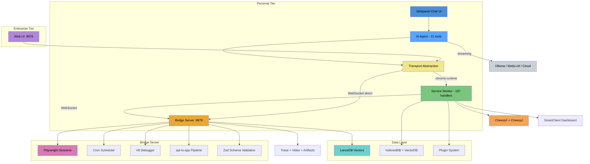
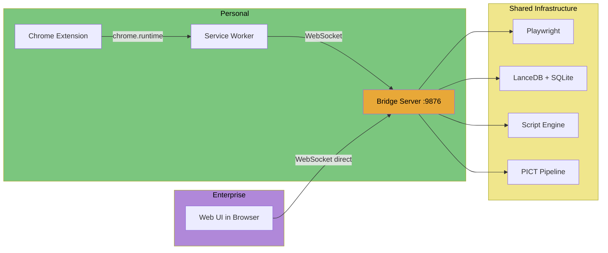
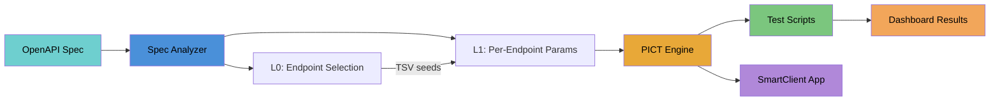
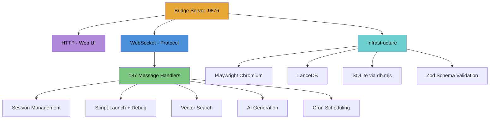

# Agentidev

**AI-powered browser automation, semantic memory, and agentic UI generation platform.**

Agentidev turns your browser into a programmable development environment. An AI agent with 21 tools lives in the sidepanel — it can browse any website, search your history, run Python, generate SmartClient dashboards, create combinatorial API test suites from OpenAPI specs, and produce apps from those specs. A WebSocket bridge orchestrates Playwright sessions, and everything runs locally.

No cloud required. No API keys required. Works offline with WebLLM.

---

## Architecture



### Two Deployment Tiers

The same agent tools, handlers, and pipeline work in both tiers. The transport abstraction (`transport.js`) is the only difference:



**Personal tier**: Chrome extension + bridge server on always-on PC. Survives browser crashes (bridge keeps running). Local-first, privacy-preserving.

**Enterprise tier**: Same bridge server on a cloud VM. Web UI served from `http://localhost:9876/`. No extension needed. Same 21 tools, same pipeline.

---

## Quick Start

```bash
git clone https://github.com/bigale/agentidev.git
cd agentidev
node scripts/setup.mjs    # Creates junctions, installs Playwright Chromium

npm run bridge &           # Start bridge server (port 9876)
npm run browser            # Launch Chromium with extension
```

Then open the sidepanel, select an agent from the dropdown, and start chatting.

### LLM Setup (pick one)

**Ollama (recommended):**
```bash
curl -fsSL https://ollama.com/install.sh | sh
ollama pull llama3.2:3b
# Allow Chrome extension access:
sudo mkdir -p /etc/systemd/system/ollama.service.d
echo -e '[Service]\nEnvironment="OLLAMA_ORIGINS=*"' | sudo tee /etc/systemd/system/ollama.service.d/override.conf
sudo systemctl daemon-reload && sudo systemctl restart ollama
```

**WebLLM (fully offline):** No setup — select in agent dropdown. Needs WebGPU (Chrome 113+). Downloads model (~2GB) on first use.

**Cloud API:** Select Sonnet/Haiku/Opus in agent dropdown (uses bridge Claude CLI).

---

## AI Agent

The agent runs in the sidepanel with 21 tools powered by pi-mono (pi-ai + pi-agent-core):

| Category | Tools | What they do |
|----------|-------|-------------|
| **Browse** | `browse_navigate/snapshot/click/fill` | Playwright browser automation |
| **Memory** | `memory_search` | Semantic search over browsing history |
| **Exec** | `exec_python`, `exec_shell` | Run code in CheerpX Linux VM |
| **Files** | `fs_read`, `fs_write` | CheerpX VM filesystem |
| **Network** | `network_fetch` | CORS-free HTTP fetch |
| **UI Gen** | `sc_generate`, `sc_validate` | SmartClient dashboard generation |
| **Scripts** | `script_list/save/launch` | Manage and run automation scripts |
| **Testing** | `test_plugin`, `generate_plugin_test` | CDP plugin testing |
| **API** | `api_to_app` | OpenAPI spec to PICT test suite + app |
| **Info** | `session_list`, `plugin_list` | List sessions and plugins |

Global agent selector above the tabs — persists across modes, syncs with Agent chat and Agentiface generation.

---

## API-to-App Pipeline

Generate combinatorial test suites and apps from OpenAPI specs:



```bash
# Full loop: API tests + state machine + multi-entity app + UI tests
node packages/bridge/api-to-app/pipeline.mjs \
  --endpoint=all --workflow --full-loop --seed=42
```

**Test coverage (Petstore v2, ~502 total assertions):**

| Layer | Cases | What It Catches |
|-------|-------|-----------------|
| Functional (PICT) | 254 | Parameter combinations per endpoint |
| Schema validation | +159 | Wrong field types, missing fields, invalid enums |
| Auth suite (L0) | 54 | Endpoint x auth type with PICT constraints |
| State machine | 23 | CRUD lifecycle transitions (10 states) |
| UI tests | 11 | Filter + create + sort + error handling |
| Workflow | 6 | Linear POST->GET->DELETE |

9 pipeline modules, 10 endpoints, multi-entity TabSet app (Pet + Order)

---

## Plugin Testing

Two levels of plugin testing, both using CDP to connect to the extension browser (port 9222):

**Quick check** (agent tool):
```
test_plugin("csv-analyzer")
-> title: CSV Analyzer, configLoaded: true, 59 components
```

**Full CDP test** (agent tool):
```
generate_plugin_test({
  pluginId: "csv-analyzer",
  componentIds: ["loadForm", "btnLoad", "summaryGrid"],
  clicks: [{ buttonId: "btnLoad", expectGrid: "summaryGrid" }]
})
-> Generates + saves a 16-assertion test script, run from dashboard
```

Reference: `examples/test-csv-analyzer.mjs` — 16 assertions, 3 screenshots, all passing.

---

## Dashboard

SmartClient-powered control center:

- **Sessions** — create/destroy Playwright browser sessions
- **Scripts** — library with Monaco editor, version history
- **Script History** — live/archive mode with assertions tab
- **Trace/Video** — Playwright tracing + video recording
- **Console/Network** — live browser output panels
- **Assertions** — real-time pass/fail from test scripts
- **Schedules** — cron-based automation
- **Help** — 15-section searchable reference

---

## Plugins

Self-contained tools with manifest, handlers, and SmartClient UI:

```
extension/apps/csv-analyzer/
├── manifest.json
├── handlers.js
└── templates/dashboard.json
```

**Included:** `hello-runtime`, `csv-analyzer`, `sqlite-query`

**Agent-generated:** The agent can create, publish, and test plugins from natural language descriptions.

---

## Bridge Server

The portable core. Runs on Node.js with zero browser dependencies:



Key property: **no chrome.* API dependencies**. The bridge server is the enterprise deployment unit.

---

## Tech Stack

| Component | Technology |
|-----------|-----------|
| **AI Agent** | pi-mono (pi-ai + pi-agent-core), 21 tools, TypeBox schemas |
| **LLM Providers** | Ollama, WebLLM (WebGPU), OpenAI, Anthropic |
| **Transport** | Pluggable: chrome.runtime (extension) or WebSocket (CLI/server) |
| **Bridge Server** | Node.js, HTTP + WebSocket, Playwright, LanceDB, Zod validation |
| **Extension** | Chrome MV3, Service Worker (187 handlers), Offscreen Document |
| **UI Framework** | SmartClient LGPL v14.1p (bundled, 5 skins) |
| **API Testing** | PICT (pairwise combinatorial), ScriptClient assertions |
| **Code Editor** | Monaco Editor |
| **Vector Search** | all-MiniLM-L6-v2 via transformers.js + LanceDB |
| **Java Runtime** | CheerpJ 4.2 (JVM to WASM) |
| **Linux Runtime** | CheerpX 1.0.7 (x86 to WASM) |
| **Scheduling** | Croner (cron expressions) |
| **Build** | esbuild (pi-bundle.js), native ESM (no webpack) |

---

## Documentation

Built-in docs in the sidepanel (book tab):
- Getting Started
- Dashboard Guide
- Plugin Development
- Agent Guide
- API-to-App Pipeline
- Troubleshooting

AI context rules in `packages/ai-context/sources/` — synced to Claude Code, Cursor, and Copilot formats via `npm run ai:sync`.

---

## Project Structure

```
agentidev/
├── extension/                 # Chrome MV3 extension
│   ├── sidepanel/agent/       # AI agent (tools, setup, transport, provider)
│   ├── sidepanel/modes/       # UI modes (search, QA, agent, AF, docs, auto)
│   ├── smartclient-app/       # SmartClient sandbox (renderer, dashboard)
│   ├── lib/handlers/          # SW message handlers
│   └── apps/                  # Plugins (csv-analyzer, sqlite-query, etc.)
├── packages/
│   ├── bridge/                # WebSocket server + Playwright + scripts
│   │   ├── api-to-app/        # PICT pipeline (spec, runner, generator)
│   │   ├── web-ui/            # Enterprise web UI (served at :9876)
│   │   └── handler-schemas.mjs # Zod validation schemas
│   ├── forge/                 # SmartClient UI toolkit (LGPL)
│   └── ai-context/            # AI rules synced to Claude/Cursor/Copilot
├── examples/                  # Test scripts (csv-analyzer, petstore, etc.)
├── docs/guide/                # User documentation (markdown)
└── plans/                     # Architecture research docs
```

---

## License

MIT License — see [LICENSE](LICENSE).

SmartClient runtime (`extension/smartclient/`) is LGPL-2.1-only — see [NOTICE](NOTICE).
