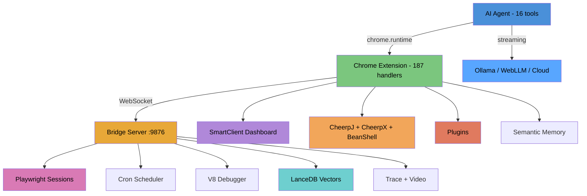

# Agentidev

**AI-powered browser automation, semantic memory, and agentic UI generation platform.**

Agentidev turns your browser into a programmable development environment. An AI agent with 16 tools lives in the sidepanel — it can browse any website, search your history, run Python, fetch URLs, and generate SmartClient dashboards. A WebSocket bridge orchestrates Playwright sessions, and everything runs locally.

No cloud required. No API keys required. Works offline with WebLLM.

---

## What You Get

- **AI Agent** in the sidepanel — chat interface with 16 tools, streaming responses, tool calling with self-correction
- **Browser automation** via Playwright — sessions, snapshots, screenshots, tracing, video recording
- **Semantic memory** — vector search over browsing history (384-dim, all-MiniLM-L6-v2)
- **SmartClient dashboard** — sessions, scripts, schedules, test results, assertions, artifacts
- **Plugin system** — CSV analyzer, SQLite query, hello-runtime, and your own
- **CheerpX VM** — Python/Linux commands in the browser (x86 WASM)
- **CheerpJ** — Java in the browser (WASM)
- **Documentation** — searchable guides in the sidepanel

---

## Quick Start

```bash
git clone https://github.com/bigale/agentidev.git
cd agentidev
node scripts/setup.mjs    # Creates junctions, installs Playwright Chromium

npm run bridge &           # Start bridge server (port 9876)
npm run browser            # Launch Chromium with extension
```

Then open the sidepanel → click **Agent** (🤖) → start chatting.

### LLM Setup (pick one)

**Ollama (recommended):**
```bash
curl -fsSL https://ollama.com/install.sh | sh
ollama pull llama3.2:3b
# Allow Chrome extension access:
sudo mkdir -p /etc/systemd/system/ollama.service.d
echo -e '[Service]\nEnvironment="OLLAMA_ORIGINS=*"' | sudo tee /etc/systemd/system/ollama.service.d/override.conf
sudo systemctl daemon-reload && sudo systemctl restart ollama
```

**WebLLM (fully offline):** No setup — select in Agent Settings. Needs WebGPU (Chrome 113+). Downloads model (~2GB) on first use.

**Cloud API:** Enter OpenAI or Anthropic key in Agent Settings.

---

## Architecture



---

## AI Agent

The agent runs in the sidepanel with 16 tools powered by pi-mono (pi-ai + pi-agent-core):

| Tool | What it does |
|------|-------------|
| `browse_navigate/snapshot/click/fill` | Playwright browser automation |
| `memory_search` | Semantic search over browsing history |
| `exec_python` | Run Python 3 in CheerpX VM (PYTHONHASHSEED=0 auto-injected) |
| `exec_shell` | Run shell commands (ls, grep, awk, sed) |
| `fs_read/fs_write` | CheerpX VM filesystem |
| `network_fetch` | CORS-free HTTP fetch via extension |
| `sc_generate` | Generate SmartClient UI from description |
| `sc_validate` | Validate SmartClient config JSON |
| `plugin_list` | List installed plugins |
| `session_list/script_list` | List sessions and scripts |

Progressive LLM chain: Ollama → WebLLM → Cloud API → prompt user.

---

## Dashboard

SmartClient-powered control center:

- **Sessions** — create/destroy Playwright browser sessions, status display
- **Scripts** — library with Monaco editor, version history, recipe system
- **Script History** — live/archive mode, double-click to open in editor
- **Trace/Video** — toolbar toggles, auto-stop on script completion, trace viewer
- **Console/Network** — live session browser output
- **Assertions** — real-time pass/fail from `client.assert()` test scripts
- **Schedules** — cron-based automation with run history
- **Help** — searchable 15-section reference

### Two Run Modes

- **Run** — standalone: script launches its own browser
- **Session ▼** — dropdown picks a ready session, script runs in that browser (stays open after)

---

## Plugins

Self-contained tools with manifest, handlers, and SmartClient UI:

```
extension/apps/csv-analyzer/
├── manifest.json        # Plugin metadata
├── handlers.js          # SW handler registration
└── templates/
    └── dashboard.json   # SmartClient UI config
```

**Included plugins:**
- `hello-runtime` — reference plugin exercising all runtimes
- `csv-analyzer` — load CSV from URL, filter/sort/limit, column stats
- `sqlite-query` — SQL queries via Python sqlite3 module

**Key actions:** `dispatchAndDisplay`, `fetchAndLoadGrid` (with `_payloadFrom` and `_dynamicFields`), `streamSpawnAndAppend`, CRUD actions.

---

## Playwright Automation

### One-Line Shim

```javascript
// Replace your Playwright import:
import { chromium } from './packages/bridge/playwright-shim.mjs';
```

The shim auto-connects to the bridge, wraps page interactions as checkpoints, enables pause/resume from the dashboard, and reuses session browsers via CDP.

### Session-Linked Scripts

Scripts run in a session's existing browser — the session stays open after for inspection. The shim reuses the session's blank page instead of opening new windows.

### Test Scripts

```javascript
import { ScriptClient } from './packages/bridge/script-client.mjs';
const client = new ScriptClient('my-test', { totalSteps: 3 });
await client.connect();
client.assert(condition, 'description');
await client.artifact({ type: 'screenshot', label: 'Result', filePath: '/tmp/shot.png', contentType: 'image/png' });
await client.complete({ assertions: client.getAssertionSummary() });
```

---

## Host Capabilities

Stable `window.Host` interface for privileged operations:

```javascript
const host = window.Host.get();
await host.network.fetch('https://any-url.com');          // CORS-free
await host.exec.spawn('/usr/bin/python3', ['-c', code]);  // CheerpX VM
await host.fs.write('/tmp/data.csv', csvContent);         // VM filesystem
await host.storage.set('key', { data: 42 });              // chrome.storage
host.runtimes.get('cheerpj').runMain({ jarUrl, className, args });
```

Three runtimes: CheerpJ (Java WASM), CheerpX (x86 Linux VM), BeanShell (Java scripting).

---

## Documentation

Built-in docs in the sidepanel (📖 tab):
- Getting Started
- Dashboard Guide
- Plugin Development
- Agent Guide
- Troubleshooting

Source: `docs/guide/*.md` — markdown rendered with built-in viewer, searchable.

---

## CheerpX Notes

The bundled `debian_mini.ext2` image has **entropy starvation** — `getrandom()` blocks because the browser VM has no hardware entropy sources. Mitigations:

- `PYTHONHASHSEED=0` auto-injected for all Python commands (stdlib imports work: json, csv, re, sqlite3, hashlib)
- 30s spawn timeout with Ctrl+C recovery (queue never permanently jams)
- sqlite3 CLI binary still hangs (use Python's sqlite3 module instead)

---

## Windows Support

Native Windows is supported alongside WSL2:
- `node scripts/setup.mjs` creates junctions (no admin needed)
- SmartClient SDK bundled (27MB LGPL, zero-setup)
- Bridge conflict detection prevents WSL2/Windows port collisions
- PowerShell `Compress-Archive` for trace packaging

---

## Tech Stack

| Component | Technology |
|-----------|-----------|
| **AI Agent** | pi-mono (pi-ai + pi-agent-core), 16 tools, TypeBox schemas |
| **LLM Providers** | Ollama, WebLLM (WebGPU), OpenAI, Anthropic |
| **Bridge Server** | Node.js, WebSocket, Playwright, LanceDB |
| **Extension** | Chrome MV3, Service Worker (187 handlers), Offscreen Document |
| **UI Framework** | SmartClient LGPL v14.1p (bundled, 5 skins) |
| **Code Editor** | Monaco Editor |
| **Vector Search** | all-MiniLM-L6-v2 via transformers.js |
| **Java Runtime** | CheerpJ 4.2 (JVM → WASM) |
| **Linux Runtime** | CheerpX 1.0.7 (x86 → WASM) |
| **Scheduling** | Croner (cron expressions) |
| **Build** | esbuild (pi-bundle.js), native ESM (no webpack) |

---

## License

MIT License — see [LICENSE](LICENSE).

SmartClient runtime (`extension/smartclient/`) is LGPL-2.1-only — see [NOTICE](NOTICE).
