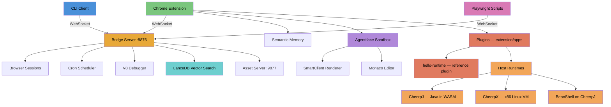

# Agentidev

**AI-powered browser automation, semantic memory, and UI generation platform.**

Agentidev turns your browser into a programmable development environment. A WebSocket bridge orchestrates Playwright sessions, a Chrome extension provides semantic search and live automation controls, and an AI UI builder generates full SmartClient applications from natural language prompts.

Everything runs locally. No cloud. No API keys required.

---

## Architecture



---

## Bridge Server

WebSocket hub on port 9876 that coordinates all automation.

- **Session management** -- create, navigate, snapshot, click, fill, evaluate, destroy Playwright browser pages
- **Script orchestration** -- launch scripts as child processes with lifecycle tracking (registered -> running -> checkpoint -> complete/cancelled)
- **V8 line-level debugging** -- `--inspect-brk` on scripts, breakpoints, step/continue via Inspector Protocol
- **Cron scheduling** -- persistent schedules in `~/.agentidev/schedules.json` with overlap prevention
- **LanceDB vector search** -- 384-dim embeddings indexed by source partition (showcase, reference, browsing)
- **Auth capture** -- save and replay browser authentication state across sessions
- **File watcher** -- monitors `~/.agentidev/scripts/` with debounced sync to extension

---

## Playwright Automation

### One-Line Shim

Replace your Playwright import with the bridge shim to get dashboard-visible automation with zero code changes:

```javascript
// Before
import { chromium } from 'playwright';

// After
import { chromium } from './packages/bridge/playwright-shim.mjs';
```

The shim auto-connects to the bridge, wraps all page interactions as declared checkpoints (`p1:navigate`, `p1:click`, etc.), and enables pause/resume/cancel from the dashboard.

### Script Client SDK

For scripts that need more control:

```javascript
import { ScriptClient } from './packages/bridge/script-client.mjs';

const client = new ScriptClient('my-script');
await client.connect();

// Checkpoints pause execution when breakpoints are set
await client.checkpoint('data_loaded', { rows: 42 });

// Dashboard-visible polling with auto-pause support
await client.poll(async () => {
  const data = await scrape();
  await client.checkpoint('poll_complete', { count: data.length });
}, 30000); // every 30s

// Interruptible sleep
await client.sleep(5000);
```

### Features

- **Live dashboard view** -- see script state, progress, checkpoints, console output in real time
- **Pre-breakpoints** -- set breakpoints before launch (no timing race)
- **Session reuse** -- scripts inherit browser sessions via CDP endpoint
- **Artifact capture** -- screenshots and data saved at checkpoints
- **Force-kill** -- SIGTERM + SIGKILL after 2s for stuck scripts

---

## Chrome Extension

Chrome MV3 extension with 6-tab sidepanel:

| Tab | Function |
|-----|----------|
| **Search** | Semantic search across browsing history (all-MiniLM-L6-v2, 384-dim vectors) |
| **Q&A** | Natural language questions with LLM-powered answers (Phi-3-mini, token budget managed) |
| **Extract** | Intelligent web scraping with automatic pagination and schema inference |
| **Agent** | AI agent automation |
| **Automation** | Bridge status, active script summary, page intercept toggles |
| **Agentiface** | AI-powered SmartClient UI builder with project workspace |

### Semantic Memory

- Automatic content capture and indexing as you browse
- Neural embeddings via Web Worker (service workers cannot run WASM)
- Source-partitioned vector DB: `browsing`, `showcase`, `reference`
- Cosine similarity search with < 300ms query latency
- Privacy-preserving: raw content never leaves your browser

### Dashboard

SmartClient-powered sandbox iframe with:
- 3-column PortalLayout (sessions, scripts, schedules)
- Live script monitoring with state machine visualization
- Monaco code editor with V8 debugger integration
- Artifact browser with inline preview

---

## Host Capabilities & Runtimes

A stable interface (`window.Host`) that lets app code call privileged operations — storage, fs, exec, network, message — without touching `chrome.runtime.*` directly. The chrome extension is the **baseline host**; ports to other shells (web, Tauri, mobile) implement the same interface and stub or proxy whatever their environment can't provide. The design rule is **port by removal**: extension → web is "drop privileges that aren't available," not "add features you didn't have."

Beyond the basic capability surface, hosts expose a `runtimes` registry. Plugins can pull in heavy execution substrates — Java, x86 Linux, scripting interpreters — without each one having to invent its own bootstrap. Today three runtimes are registered out of the box:

| Runtime | Type | What it runs | Cold start | Warm |
|---------|------|--------------|------------|------|
| `cheerpj` | `library` | JVM bytecode (Java 11) via [CheerpJ](https://cheerpj.com/) | ~5 s | ~3 s |
| `cheerpx` | `vm` | Full x86 Linux (Debian mini) via [CheerpX](https://cheerpx.io/) | ~1.3 s | ~130 ms |
| `bsh` | `interpreter` | [BeanShell](https://github.com/beanshell/beanshell) Java scripting, composed on `cheerpj` | ~2.7 s | ~1.3 s |

```javascript
const host = window.Host.get();

// ---- Runtimes ----
host.runtimes.list();                                       // → ['cheerpj', 'cheerpx', 'bsh']

await host.runtimes.get('cheerpj').runMain({                // Java main via CheerpJ
  jarUrl: 'http://localhost:9877/nist-validator.jar',
  extraJars: ['http://localhost:9877/nolog-wrap.jar'],
  className: 'NoLogValidator', args: [hl7Message, profileXml],
});

await host.runtimes.get('cheerpx').spawn('/usr/bin/python3', ['-c', 'print(1+1)']);
// → { exitCode: 0, stdout: '2\n' }

await host.runtimes.get('bsh').eval('Math.sqrt(2025)');     // BeanShell on CheerpJ
// → '45.0'

// ---- Host capability surfaces ----
await host.storage.set('key', { n: 42 });                   // key/value storage
await host.storage.get('key');                               // → { n: 42 }
await host.storage.blob.put('b', new Uint8Array([1,2,3]));  // binary blob storage
await host.storage.blob.get('b');                            // → Uint8Array(3)

await host.network.fetch('https://example.com/api');         // CORS-free fetch (full host_permissions)
// → { ok: true, status: 200, text: '...' }

await host.exec.spawn('/usr/bin/python3', ['-c', 'print(42)']);        // collect-and-return
// → { exitCode: 0, stdout: '42\n' }

const handle = host.exec.spawnStream('/bin/sh', ['-c', 'for i in 1 2 3; do echo $i; sleep 0.5; done']);
handle.onStdout(chunk => liveConsole.append(chunk));         // chunks arrive progressively
const result = await handle.done;                            // → { exitCode: 0, stdout: '1\n2\n3\n' }

await host.fs.write('/tmp/demo.txt', 'hello\nworld\n');      // write to the Linux VM filesystem
await host.fs.list('/tmp');                                   // → { entries: [{name:'demo.txt', type:'file', ...}] }
await host.fs.read('/tmp/demo.txt');                          // → { content: 'hello\nworld\n' }
await host.fs.read('/tmp/demo.txt', { as: 'bytes' });        // → { bytes: [104,101,...] }

const unsub = host.fs.watch('/tmp/demo.txt', evt => { ... });// polling-based, create/change/delete
unsub();                                                     // stop watching

host.identity.installId;                                     // → 'ncbbpgbdecmmcmghfahmmpddapbncobd:qku87yrm8ojmnv3ulm0'
```

### Architecture

CheerpJ and BeanShell live in a hidden iframe inside the extension's offscreen document. CheerpX needs cross-origin isolation (SharedArrayBuffer + worker coordination), so it lives in a hidden background tab opened via `chrome.tabs.create({active: false})` with COOP/COEP headers from the asset server — a top-level browsing context can become COI on its own, an extension iframe cannot.

A small `asset-server.mjs` (port 9877) serves JAR/disk-image bytes with CORS, range requests, and scoped COI headers. Plugin assets sit in `~/.agentidev/cheerpx-assets/` and are not bundled into the extension.

### Real-world tested

- **NIST HL7 v2 validator** — 24 MB shaded fat JAR (Kotlin + Java + HAPI HL7 + javax.xml) parses an XML profile, validates an HL7 v2 message, and returns a structured JSON report end-to-end through a seven-hop chain in ~3 s.
- **Runtime composition** — `bsh` is ~150 lines of code with zero CheerpJ-specific glue; it just calls `host.runtimes.get('cheerpj').runMain(...)` and parses stdout, declaring `dependsOn: ['cheerpj']` so init order resolves automatically.

Full writeups: [`extension/cheerpj-app/STATUS.md`](extension/cheerpj-app/STATUS.md) and [`extension/cheerpx-app/STATUS.md`](extension/cheerpx-app/STATUS.md).

---

## Plugins

Self-contained extensions that target the host capability interface and ship a SmartClient UI mode. Each plugin lives in `extension/apps/<plugin-id>/` and bundles a manifest, message handlers, templates, and optional assets. Private plugins (e.g., domain-specific apps) are assembled in from outside repos at build time and never enter public history. The reference plugin `hello-runtime` is checked in.

```
extension/apps/hello-runtime/
├── manifest.json
├── handlers.js
└── templates/
    └── dashboard.json
```

```jsonc
// manifest.json — minimum
{
  "id": "hello-runtime",
  "name": "Hello Runtime",
  "version": "0.1.0",
  "modes": ["hello-runtime"],
  "templates": { "dashboard": "templates/dashboard.json" },
  "handlers": "handlers.js",
  "requires": {
    "hostCapabilities": ["message"],
    "runtimes": ["cheerpj", "cheerpx", "bsh"]
  }
}
```

### Discovery + loader

`extension/lib/plugin-loader.js` runs at service-worker boot, reads `extension/apps/index.json` for the active-plugin list, validates each manifest, and registers each plugin's handlers on the same dispatch table the platform uses. Plugin handlers are first-class peers of platform handlers — they receive the same `handlers` object and can call any other handler in the table.

MV3 service workers cannot use dynamic `import()` ([W3C spec restriction](https://github.com/w3c/ServiceWorker/issues/1356)), so the loader resolves handler modules through a static registry at `extension/apps/_loaded.js`. Plugin assemble scripts edit this file when installing a new plugin.

### Mode dispatch

Opening `chrome-extension://<id>/smartclient-app/wrapper.html?mode=<plugin-id>` triggers `bridge.js` to look up the plugin via `PLUGIN_LIST`, fetch its dashboard template via `PLUGIN_GET_TEMPLATE`, and render it through the existing SmartClient renderer. No special template wiring is required — the same code path the AI generation uses.

### `hello-runtime` — the in-tree reference plugin

A live demo of every platform layer end-to-end. The dashboard has three buttons; each fires a plugin handler that wraps a different host runtime and writes the result into an HTMLFlow output pane via the renderer's generic `dispatchAndDisplay` action.

| Button | Handler | Runtime | Output |
|---|---|---|---|
| Run BeanShell (1 + 1) | `HELLO_RUNTIME_BSH` | `bsh` (composed on cheerpj) | `2` |
| Run Python (CheerpX) | `HELLO_RUNTIME_CHEERPX` | `cheerpx` | `4.15.0-54-cheerpx` + `42` |
| Run Java main (CheerpJ) | `HELLO_RUNTIME_CHEERPJ` | `cheerpj` | hello-main JAR stdout |

Plugin handlers contain **zero direct `chrome.runtime.*` calls** — they reach the runtimes through the dispatch table, the same way platform-internal modules do. `hello-runtime/handlers.js` is ~80 lines.

To open the demo:

```
chrome-extension://<extension-id>/smartclient-app/wrapper.html?mode=hello-runtime
```

`hello-runtime` is the regression target for any new host capability work — when adding `host.fs`, `host.exec` streaming, or `host.network`, extending this plugin's dashboard is the cheapest way to prove the addition end-to-end.

### Private plugins

Plugins that should never enter public history (e.g., proprietary domain apps) live in their own private repos and are assembled into `extension/apps/<id>/` at build time via a small `assemble.sh` script that `rsync`s sources into place and edits `apps/_loaded.js` to register the handler. `extension/apps/*` is gitignored with explicit exceptions for the README, the index, `_loaded.js`, and `hello-runtime/`.

Full convention writeup: [`extension/apps/README.md`](extension/apps/README.md).

---

## Agentiface

AI UI generation that turns natural language prompts into full SmartClient applications.

### How It Works

```
Prompt -> Bridge Server -> Claude (haiku) -> JSON Config -> Renderer -> Live SmartClient App
```

The renderer enforces a whitelist of allowed SmartClient types (`ListGrid`, `DynamicForm`, `TabSet`, `Window`, `TreeGrid`, `PortalLayout`, etc.) and maps actions through a safe dispatch system -- no `eval`.

### Forge Toolkit

Custom components built on SmartClient with design tokens and theme support:

| Component | Description |
|-----------|-------------|
| `ForgeListGrid` | Enhanced grid with skeleton loading animation |
| `ForgeFilterBar` | Search + filter component for grids and trees |
| `ForgeWizard` | Step-by-step wizard builder |
| `ForgeToast` | Toast notifications |
| `ForgeA11y` | Accessibility utilities |
| `ForgeRegistry` | Component registration for the builder platform |
| `ThemeManager` | Token-aware dark/light theme management |

### Templates

7 bundled templates (Blank Canvas, CRUD Manager, Master-Detail, Dashboard, Calculator, Wizard, Search Explorer) plus user-created templates saved to disk.

### Projects

Projects bind a name, description, and AI system prompt to a playground session. The description threads into generation prompts for context-aware UI creation.

---

## AI Context System

Unified source of truth in `packages/ai-context/sources/` generates tool-native configs for Claude Code, Cursor, and GitHub Copilot:

```bash
npm run ai:sync     # Regenerate all tool configs from source files
npm run ai:check    # Exit 1 if generated files are stale
```

Generates:
- `.claude/rules/*.md` -- Claude Code path-scoped rules
- `.cursor/rules/*.mdc` -- Cursor path-scoped rules
- `.github/copilot-instructions.md` -- Copilot global instructions
- `.github/instructions/*.instructions.md` -- Copilot path-scoped instructions

### Cross-Repo Export

Export project knowledge (including 627 SmartClient showcase examples with neural embeddings) to other repositories:

```bash
npm run ai:adapt -- --repo=/path/to/target    # Export knowledge
npm run ai:adapt -- --repo=/path/to/target --clean  # Remove exports
```

Generated files are prefixed `cr-` to avoid collisions. No MCP dependency -- everything works via bridge CLI shell commands.

---

## Quick Start

```bash
# Clone and install
git clone https://github.com/bigale/agentidev.git
cd agentidev
npm install

# Start the bridge server
npm run bridge &
sleep 2

# Launch Chromium with the extension loaded
npm run browser

# Load the extension manually (if needed)
# 1. Navigate to chrome://extensions/
# 2. Enable Developer mode
# 3. Load unpacked -> select the extension/ directory
```

### CLI Quick Reference

```bash
node packages/bridge/claude-client.mjs status                    # Bridge health check
node packages/bridge/claude-client.mjs session:list              # List browser sessions
node packages/bridge/claude-client.mjs session:create '{"name":"my-session"}'
node packages/bridge/claude-client.mjs session:snapshot '{"sessionId":"ID"}'
node packages/bridge/claude-client.mjs script:launch '{"path":"~/.agentidev/scripts/my-script.mjs"}'
node packages/bridge/claude-client.mjs schedule:list             # List cron schedules
```

---

## Tech Stack

| Component | Technology |
|-----------|-----------|
| **Bridge Server** | Node.js, WebSocket (`ws`), Playwright |
| **Asset Server** | Node.js HTTP, range requests, scoped COOP/COEP/CORP headers |
| **Plugin System** | Manifest-based, static handler registry (MV3 SW dynamic-import limitation), in-tree reference plugin `hello-runtime` |
| **Vector Search** | LanceDB WASM, all-MiniLM-L6-v2 (transformers.js) |
| **Scheduling** | Croner (cron expressions) |
| **Extension** | Chrome MV3, Service Worker, Offscreen Document, Web Workers |
| **Java Runtime** | CheerpJ 4.0 (JVM bytecode → WASM, Java 11) |
| **Linux Runtime** | CheerpX 1.0.7 (x86 → WASM, HttpBytesDevice + OverlayDevice) |
| **Java Scripting** | BeanShell 2.0b5 composed on CheerpJ |
| **UI Framework** | SmartClient LGPL (sandbox iframe) |
| **Code Editor** | Monaco Editor |
| **Debugging** | V8 Inspector Protocol |
| **Module System** | Native ESM throughout (no webpack for extension) |

---

## License

MIT License -- see [LICENSE](LICENSE) for details.

SmartClient components (`extension/smartclient-app/`, `packages/forge/`) use the SmartClient LGPL-2.1-only runtime. See [SmartClient licensing](https://www.smartclient.com/product/licensing) for details.
