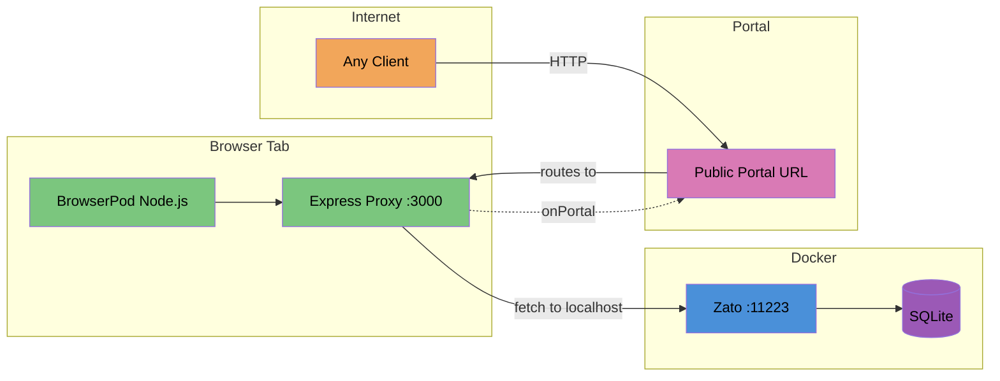

# BrowserPod Petstore Proxy — Phase 1

Boots a Node.js runtime inside the browser via [BrowserPod](https://browserpod.io), runs an HTTP proxy server that forwards requests to Zato on localhost:11223, and exposes the Petstore API on a public Portal URL.

## Architecture



## How It Works

1. **You open `http://localhost:8080`** in your browser
2. **Enter your BrowserPod API key** (from console.browserpod.io)
3. **Click "Boot Pod"** — BrowserPod loads Node.js via WebAssembly
4. **Pod creates `server.js`** — an HTTP proxy that forwards `/api/*` to Zato
5. **Pod runs `node server.js`** — server starts listening on port 3000
6. **BrowserPod creates a Portal** — a public URL routing to port 3000
7. **Anyone on the internet** can now hit the Portal URL to reach your Petstore API

The proxy runs entirely in your browser tab. No cloud infrastructure. Close the tab, the pod dies.

## Quick Start

```bash
# 1. Make sure Zato is running
npm run zato:up
npm run zato:setup   # if first time

# 2. Start the BrowserPod page server
npm run pod:serve

# 3. Open http://localhost:8080 in your browser
# 4. Enter your BrowserPod API key
# 5. Click "Boot Pod"
# 6. Wait for the Portal URL to appear
# 7. Test it:
curl <portal-url>/api/pet/findByStatus?status=available
```

## Prerequisites

- Zato container running (`npm run zato:up && npm run zato:setup`)
- BrowserPod API key (free at https://console.browserpod.io)
- Modern browser with SharedArrayBuffer support (Chrome, Edge, Firefox)

## What the Proxy Server Does

- `GET /` or `/health` — health check with uptime
- `/api/*` — proxies to Zato at localhost:11223
- `/zato/*` — proxies to Zato (for ping, etc.)
- CORS headers on all responses
- Logs each proxied request to the terminal

## Limitations

- **Ephemeral**: Pod dies when you close the browser tab
- **Single-user**: One browser tab = one pod instance
- **Latency**: WebAssembly overhead + portal routing adds latency vs direct Zato
- **Networking**: The pod uses the browser's `fetch()` for outbound requests, so it can reach localhost but not private networks the browser can't access
