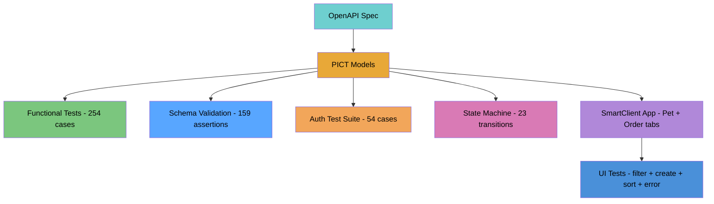
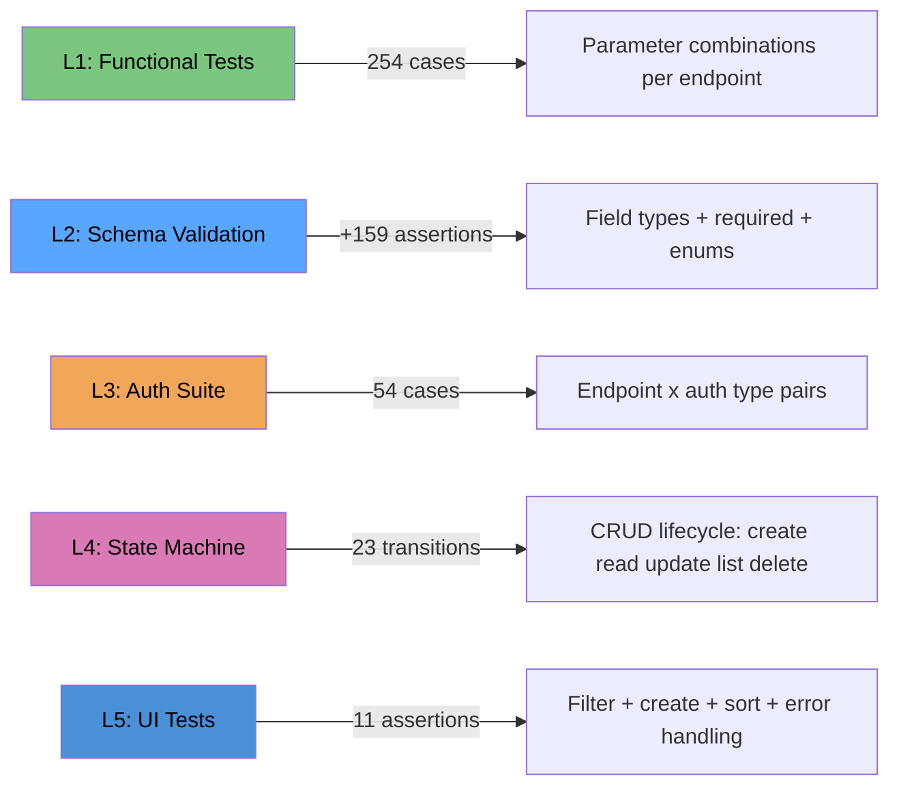
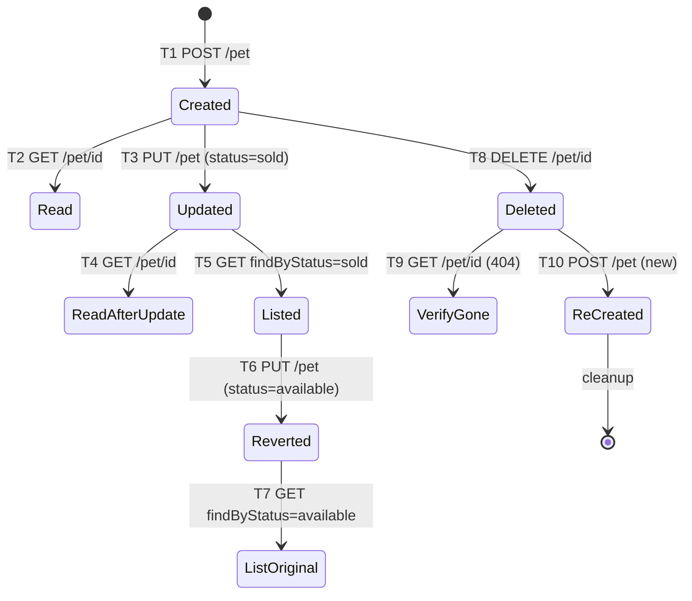

# API-to-App Pipeline

Generate combinatorial API tests, build a SmartClient app, and verify it with UI tests — all from an OpenAPI spec, in one command.

## The Closed Loop



## Test Coverage Layers



## State Machine Transitions



## Full-Loop Dashboard Workflow

1. **Select** `api-to-app-pipeline` in the Scripts panel
2. **Click Run** with args: `--endpoint=all --full-loop --workflow --seed=42`
3. **Watch** Script History: PICT generation → API tests → auth suite → state machine → app build → plugin publish → UI test
4. **Artifacts tab**: PICT models, TSV outputs, test scripts, app config, handlers
5. **Scripts panel**: generated tests auto-register (test-petstore-*, test-pet-state-machine, test-ui-pet-app)
6. **Plugins**: pet-order-app with Pet + Order tabs
7. **Run generated tests**: select any test, click Run, see assertions

### Scheduling

- Script: `api-to-app-pipeline`
- Args: `--endpoint=all --full-loop --workflow --run --seed=42`
- Cron: `0 6 * * *`

## Quick Start (CLI)

```bash
# Full loop: all tests + multi-entity app + UI tests
node packages/bridge/api-to-app/pipeline.mjs \
  --endpoint=all --workflow --full-loop --seed=42

# Generate + run API tests only
node packages/bridge/api-to-app/pipeline.mjs \
  --endpoint=all --workflow --run --seed=42
```

## Pipeline Options

| Flag | Default | Description |
|------|---------|-------------|
| `--spec=<path>` | `specs/petstore-v2.json` | OpenAPI/Swagger spec file |
| `--endpoint=<id>` | `findPetsByStatus` | Operation ID, or `all` for all endpoints |
| `--base-url=<url>` | `https://petstore.swagger.io/v2` | Target API base URL |
| `--seed=<n>` | random | Deterministic PICT seed |
| `--order=<n>` | 2 (pairwise) | Combinatorial order |
| `--workflow` | off | Linear workflow + state machine test |
| `--build` | off | Generate SmartClient app (programmatic) |
| `--full-loop` | off | Build app + publish + generate UI tests |
| `--run` | off | Execute generated tests |
| `--dry-run` | off | Print PICT models only |

## Coverage Numbers

| Test Layer | Cases/Assertions | What It Catches |
|-----------|-----------------|-----------------|
| Functional (PICT) | 254 cases | Parameter combinations per endpoint |
| Schema validation | +159 assertions | Wrong field types, missing required fields, invalid enums |
| Auth suite (L0) | 54 cases | Every endpoint x auth type with PICT constraints |
| Linear workflow | 6 steps | Basic POST→GET→DELETE sequence |
| State machine | 23 transitions | update→list, revert, re-create after delete |
| UI: filter | 3 assertions | Filter form → grid loads data |
| UI: create | 1 assertion | Create form → submit → grid updates |
| UI: sort | 1 assertion | Column sort changes row order |
| UI: error | 1 assertion | Invalid filter → graceful handling |
| **Total** | **~502** | |

## Auth Separation

Auth is tested separately from functional behavior:

- **Auth suite** (L0): PICT model covers `Endpoint × AuthType × Accept × ContentType` with constraints. 54 cases.
- **Functional tests** (L1): No auth params — all calls assume valid auth. 27% fewer cases.

## Response Schema Validation

Every positive API test validates the response body field-by-field against the OpenAPI schema:
- Required fields present (`name`, `photoUrls` for Pet)
- Integer fields: `typeof === 'number'`
- Enum fields: value in allowed set
- Array fields: `Array.isArray()`

## Multi-Entity App

`--full-loop` with `--endpoint=all` generates a TabSet app:
- **Pet tab**: filter by status, fetch grid, create form
- **Order tab**: grid, create form
- Published as `pet-order-app` plugin

## The fetchUrlAndLoadGrid Action

Storage-backed plugins call APIs directly via HOST_NETWORK_FETCH:

```json
{
  "_action": "fetchUrlAndLoadGrid",
  "_fetchUrl": "https://petstore.swagger.io/v2/pet/findByStatus",
  "_fetchMethod": "GET",
  "_payloadFrom": "filterForm",
  "_targetGrid": "mainGrid",
  "_dynamicFields": true,
  "_flattenObjects": true
}
```

## Pipeline Modules

| Module | Purpose |
|--------|---------|
| `spec-analyzer.mjs` | Parse spec, generate PICT models, auth model |
| `pict-runner.mjs` | Execute PICT CLI, parse TSV |
| `test-generator.mjs` | PICT rows → API test scripts with schema validation |
| `app-from-pict.mjs` | PICT models → SmartClient plugin (single or multi-entity) |
| `build-driver.mjs` | LLM-enhanced generation |
| `ui-test-generator.mjs` | PICT models → CDP UI tests (filter + create + sort + error) |
| `state-machine.mjs` | CRUD lifecycle state machine test |
| `multi-level.mjs` | L0→L1 PICT orchestration with TSV seeding |
| `pipeline.mjs` | Orchestrator (all flags, dashboard integration) |

## Prerequisites

- **PICT**: Install from [github.com/microsoft/pict](https://github.com/microsoft/pict)
- **Node.js 22+**: Uses native `fetch`
- **Bridge server**: Required for dashboard reporting and plugin publish
