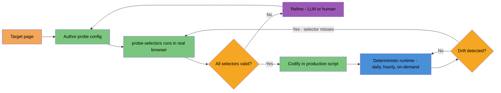
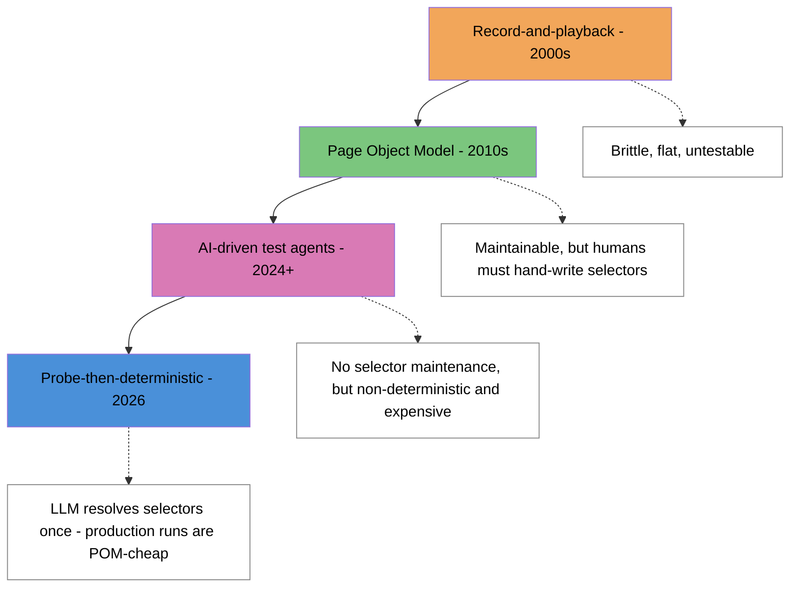
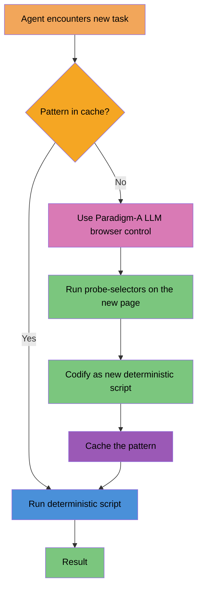
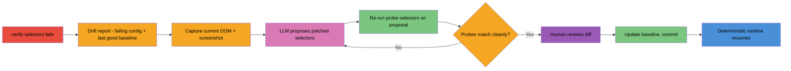
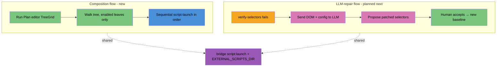

# Runtime Automation: Determinism in LLM-Controlled Browsers

A framing for where agentidev's `probe-selectors` utility sits in the bigger picture, and why it matters more than its 240 lines of code suggest.

## The split: two paradigms of LLM + browser

```mermaid
graph TB
    subgraph PA[Paradigm A: Runtime LLM Control - non-deterministic]
        A1[Page state]
        A2[Screenshot or DOM serialized]
        A3[LLM decides next action]
        A4[Action executed]
        A1 --> A2 --> A3 --> A4 --> A1
    end

    subgraph PB[Paradigm B: Dev-time Resolution - deterministic runtime]
        B1[Author writes probe config]
        B2[probe-selectors runs in real browser]
        B3[Verified selectors + ancestor tips]
        B4[Author codifies into script]
        B5[Page state]
        B6[Deterministic action]
        B1 --> B2 --> B3 --> B4 --> B5 --> B6 --> B5
    end

    style A1 fill:#F2A65A,color:black
    style A2 fill:#F2A65A,color:black
    style A3 fill:#e74c3c,color:black
    style A4 fill:#F2A65A,color:black
    style B1 fill:#7BC67E,color:black
    style B2 fill:#7BC67E,color:black
    style B3 fill:#4a90d9,color:black
    style B4 fill:#7BC67E,color:black
    style B5 fill:#D97AB5,color:black
    style B6 fill:#D97AB5,color:black
```



In **Paradigm A**, the LLM is in the loop on every action at runtime. It looks at the page, decides what to click, and dispatches. Examples in 2026: Anthropic Computer Use, browser-use, Browserbase Stagehand, OpenAI Operator. They are getting genuinely good. They are still non-deterministic — the same page, the same prompt, the same model can produce different click sequences across runs.

In **Paradigm B**, the LLM (or a human) is in the loop only at development time. Resolution happens once, the result is captured as code, and runtime is fully deterministic. This is what test automation has been doing for two decades.

Both paradigms are correct. They solve different problems. The mistake is using A when B will do.

## Where current LLM browser tools sit (April 2026)

| Tool | Paradigm | Determinism | Cost per run | Best for |
|---|---|---|---|---|
| Computer Use (Anthropic) | A | Low | $0.10–1.00 | Novel pages, exploratory tasks |
| browser-use | A | Low–medium | $0.05–0.50 | Multi-step workflows on varied UIs |
| Stagehand (Browserbase) | A with caching | Medium | $0.05–0.30 | Production agents on stable UIs |
| Selenium / Playwright (raw) | B | High | <$0.001 | Test automation, scraping |
| **probe-selectors → custom script** | **B with LLM/dev assist** | **High** | **<$0.001** | **Repeatable agentidev tasks** |

The Paradigm-A tools have made enormous progress. They handle anti-bot challenges, dynamic UIs, and unfamiliar layouts in ways the Paradigm-B world cannot. But for a task you'll run a hundred times — daily prospect refresh, weekly competitor crawl, hourly status check — paying $0.10/run when $0.001/run would do is wasteful, and the variance compounds. **Determinism is cheap and valuable when you can get it.**

## What probe-selectors actually is

It's the *bridge between paradigms*: the artifact you produce at dev time that lets runtime be deterministic.



Per-probe, it reports:

- match count
- sample element details (tag, role, aria-label, data-* attrs, href, text)
- the first **clickable ancestor** in the parent chain — the bit that catches the most common gotcha (`closest('button')` failing because Google uses `<div role="button">`)

That ancestor-walk is small but it's the difference between a 30-second turnaround and a 30-minute one when something doesn't work.

## What this lineage looks like in test automation

This pattern isn't new. QA automation has been here three times:



The latest pattern — what `probe-selectors` enables — keeps the maintenance economy of the Page Object Model but uses an LLM (or a human, or both) at *dev time only* to do the discovery work that used to be tedious. Production runs stay cheap and deterministic. The LLM only re-engages when something breaks.

## When to use which paradigm

| Property of the task | Paradigm A (runtime LLM) | Paradigm B (dev-time + deterministic) |
|---|---|---|
| You'll run it once or a few times | ✅ | overkill |
| You'll run it 100+ times | overkill | ✅ |
| Page UI changes weekly | ✅ self-heals | ⚠️ needs maintenance |
| Page UI is stable for months | overkill | ✅ |
| Latency matters (interactive) | ⚠️ 5–30s per step | ✅ <1s |
| Cost matters (scheduled, batched) | ⚠️ $0.05–1.00/run | ✅ near-zero |
| You need traceable, auditable steps | ⚠️ LLM transcript | ✅ git-tracked code |
| The target page is brand new | ✅ figures it out | ❌ no selectors yet |

For agentidev's prospect-crm use cases — scraping the same Maps results page repeatedly, enriching the same detail-page layout 100s of times — Paradigm B is overwhelmingly correct. `probe-selectors` is what makes Paradigm B accessible to a single developer who'd otherwise reach for Paradigm A out of convenience.

## What this means for the shadow-org architecture

The [agentic architecture plan](agentic-architecture-plan.md) sketches a multi-agent shadow organization that reads from real systems and produces analysis. That whole vision becomes much more tractable when you can move work from Paradigm A to Paradigm B as patterns stabilize:



In other words: agents start out using Paradigm A on unfamiliar pages, then *promote* what they learn into Paradigm B by running a probe and writing a script. Over time, the shadow org's runtime cost trends toward zero and its determinism trends toward 100%, even as the set of sites it reads from grows.

This promotion step — from learned-by-LLM to codified-as-script — is the **engineering primitive** worth getting right. Today it's manual: the developer (or the user) writes the probe config and reads the report. Tomorrow it could be automated: an LLM agent that just hit a new page can author its own probe config, run it, read its own report, and codify a script — all without human intervention.

## Selector drift and self-healing — open question

The honest weakness of Paradigm B is that selectors break when UIs change. Paradigm A self-heals by definition. The hybrid model needs an answer:

| Approach | What it does | Status in agentidev |
|---|---|---|
| **Re-run probe nightly with drift detection** | Track which selectors lose their matches; alert via assertions | **`verify-selectors.mjs` (consulting-template/scripts/)** |
| **Wrap deterministic script with Paradigm-A fallback** | If `el == null`, hand off to LLM browser control to re-resolve | Not implemented |
| **Multi-selector tolerance** | Each probe records 2–3 alternative selectors; fall back across them | Possible by extending probe-selectors output |
| **LLM-suggested selector repair** | When a selector misses, send the failing config + current DOM to an LLM, get a fix | Future work |

### verify-selectors: nightly drift detection

`verify-selectors.mjs` re-runs a probe config against the live page and diffs the result against a saved baseline (the JSON output of an earlier successful probe). Three severity levels:

- **✓ unchanged** — same count, same tag/role/clickable ancestor on first sample
- **⚠ warn** — count changed (still >0), or sample tag/role/clickable ancestor changed, or expected `data-*` attribute disappeared
- **✗ breaking** — match count went to 0 (selector no longer matches anything)

Each probe becomes one ScriptClient assertion, so drift surfaces in the dashboard's Test Results portlet. The script also exits non-zero on drift for shell pipelines and cron alerting.

```bash
# Capture initial baseline (one-time, after probe-selectors is clean)
node verify-selectors.mjs --config=examples/probe-google-maps-detail.json \
  --baseline=baselines/probe-google-maps-detail.baseline.json \
  --update-baseline

# Daily verification (intended for the dashboard Schedules portlet)
node verify-selectors.mjs --config=... --baseline=...

# Refresh baseline after intentional UI changes accepted
node verify-selectors.mjs --config=... --baseline=... --update-baseline
```

The baseline file is git-tracked alongside the probe config. When a teammate intentionally accepts a UI change (e.g. Google rebrands a button), they regenerate the baseline and commit the diff. The git history of the baseline becomes the audit trail of "we acknowledged this UI change on date X."

This closes the determinism loop: agentidev now has the dev-time, runtime, and drift-detection legs of Paradigm B as first-class scripts.

### LLM-assisted repair (planned)

The remaining gap: when drift IS detected, repair is still manual — a developer reads the diff, opens the page, figures out the new selectors, re-baselines. This is exactly the spot where Paradigm A earns its keep within an otherwise Paradigm-B system.



The flow keeps every step inspectable: the drift report names which selector failed, the LLM proposal is a patch to the probe config, the re-run of probe-selectors confirms the fix, and the baseline update is a git diff. Paradigm A handles the resolution; Paradigm B reasserts on the other side. **Nothing in the production runtime path runs an LLM.**

Estimated cost per drift event with this flow: one LLM call (sub-cent on Sonnet, free on Ollama) plus a few seconds of human review. Still vastly cheaper than running paradigm-A on every production execution.

A first cut would be a `repair-selectors.mjs` script that takes a failed verify report + the live DOM as input, prompts an LLM with both, and emits a patched probe config. Human runs `verify-selectors --update-baseline` after sanity-checking. About a one-day exercise on top of what's already shipped.

## Run Plan composition — automation as a first-class dashboard primitive

Browser automation has gone from "one capability among many" in agentidev to **the spine** of the consulting-template stack. That promotion deserves a first-class composition surface in the dashboard, not just a list of scripts the user invokes individually.

The natural shape: a hierarchical run-plan editor where the user composes ordered, multi-step automation flows from the script library, sets per-step config inline, and runs the whole tree with one click.

### The two flows are siblings, not the same thing



Different fingerprints (proactive composition vs reactive repair), different surfaces in the dashboard, but they share the same bridge substrate underneath: `script:launch` over scripts in `EXTERNAL_SCRIPTS_DIR`. Building one doesn't perturb the other.

### What the editor looks like

SmartClient's TreeGrid (already on the renderer's allowed list) supports everything this needs:

- Hierarchical data — folders + leaves, expandable
- Per-node checkboxes — `selectionAppearance: "checkbox"`
- Inline cell editing — per-row `canEdit` with per-field overrides
- Drag-reorder for siblings — `canReorderRecords: true`
- Multiple value columns visible per row

A run-plan portlet in the dashboard would render something like:

```
☑ Tampa Dental Refresh                 [order: 1]
  ☑ scrape-google-maps     --vertical=dental --query="dentists Tampa FL"
  ☑ enrich-from-maps       --vertical=dental --limit=10
  ☑ verify-selectors       --config=examples/probe-... --baseline=baselines/...
☐ Tampa HVAC Refresh                   [order: 2]
  ☑ scrape-google-maps     --vertical=hvac --query="HVAC Tampa FL"
  ...
☑ Weekly Drift Check                   [order: 3, schedule: Mon 6am]
  ☑ verify-selectors       --config=... --baseline=...
```

Each leaf is a script invocation. Each folder is a "playbook" that runs its enabled children sequentially. A side pane could mirror the JSON-equivalent live for power users.

### Run plan data model

```json
{
  "id": "run_plan_1",
  "name": "Tampa Dental Refresh",
  "enabled": true,
  "schedule": null,
  "steps": [
    {
      "id": "step_1",
      "script": "scrape-google-maps",
      "enabled": true,
      "args": { "vertical": "dental", "query": "dentists Tampa FL", "max-results": "15" },
      "stopOnFailure": false
    },
    {
      "id": "step_2",
      "script": "enrich-from-maps",
      "enabled": true,
      "args": { "vertical": "dental", "limit": "10", "max-age-days": "30" },
      "stopOnFailure": false
    },
    {
      "id": "step_3",
      "script": "verify-selectors",
      "enabled": true,
      "args": { "config": "scripts/examples/probe-google-maps-detail.json",
                "baseline": "scripts/baselines/probe-google-maps-detail.baseline.json" },
      "stopOnFailure": true
    }
  ]
}
```

Persistence: file-backed under `~/.agentidev/run-plans/` (mirrors how Agentiface apps already live), git-friendly. A run is a tree-walk that fires `script:launch` per enabled step in order, respecting `stopOnFailure`.

### Smallest reversible move

If/when this is pursued (currently not blocking anything else):

1. New `RunPlan` DataSource — file-backed under `~/.agentidev/run-plans/`
2. New "Automation" portlet in the dashboard with a TreeGrid bound to it
3. A "Run Plan" toolbar button that walks enabled steps, fires `script:launch` per step
4. Reuse the existing Script History portlet to surface results — same machinery, just appears

That's a 2-day exercise without renderer changes. Nothing about it conflicts with the LLM-repair track or the existing Scripts/Schedules portlets.

### What to defer until a v1 ships

| Feature | Why defer |
|---|---|
| Real-time per-step progress bars in the tree | Script History already shows it; integrate when there's a real desire for tighter feedback |
| LLM-generated run plans (user describes goal, agent emits tree) | Trivially layerable once the data model exists |
| Cron-scheduling whole run plans | Existing Schedules portlet handles individual scripts; "schedule a plan" is a thin wrapper later |
| Conditional steps (run B only if A succeeded with X) | Real workflow language is bigger scope; `stopOnFailure` covers the v1 cases |
| Visual graph editor (drag boxes + arrows) | TreeGrid covers 90% of the use case |
| Sub-dashboard with its own URL | PortalLayout's minimize+move handles the cramming; revisit at >10 portlets |

### Honest scope ceiling

The TreeGrid approach gives 80% of a workflow tool with 20% of the engineering. The 20% you don't get: branching, conditional logic, parallel steps, complex variable passing between steps. Those are real but rarely needed for "scrape, enrich, verify" pipelines.

If run plans grow into needing real workflow semantics (outputs from step A flowing into args for step B, branching on condition, parallel fan-out), the right move is to swap the runtime layer for a workflow engine. **Zato — already in the agentidev stack — has this.** The TreeGrid editor wouldn't preclude that future; it would just become the editor for whichever runtime backs it. The `script:launch` walk and a Zato-orchestrated run plan look identical from the editor's perspective.

This is the same separation we got right with `EXTERNAL_PLUGINS_DIR` vs Zato services: the editor (composition surface) and the runtime (execution substrate) are different concerns. Get the composition surface right with the simple runtime first; upgrade the runtime when the composition demands it.

## What probe-selectors does NOT do

To be clear about scope:

- It does not generate selectors automatically — you bring the candidates.
- It does not test full workflows — that's what bridge scripts (e.g. `enrich-from-maps.mjs`) are for.
- It does not run headless against captchas or auth walls — same browser as your interactive session.
- It does not retry, backoff, or self-heal — pure observation.

It's a microscope, not a robot. The robots are built on top of what you see through it.

## Practical workflow for adding a new enrichment target

1. Identify the page you want to enrich from (e.g. Yelp business page, LinkedIn company page, BBB profile).
2. **Visit it manually** in the bridge browser session. Note where the data you want lives in the UI.
3. **Author a probe config** under `consulting-template/scripts/examples/`. Start with 5–10 candidate selectors covering the fields you want.
4. **Run** `probe-selectors --config=<path>` from the dashboard.
5. **Read the report**. Discard misses. Note clickable-ancestor tips. Adjust selectors that hit the wrong element. Re-run.
6. **Commit the probe config** alongside any scrape/enrich script that uses those selectors. The config IS the spec — it's how a future maintainer knows what each selector is supposed to find.
7. **Write the production script** using verified selectors. Reference the probe config in the header comment.

Steps 2-5 typically take 15-30 minutes per new target. Step 7 takes another 30-60 minutes. After that, the target costs a fraction of a cent per run and stays deterministic until the upstream UI changes.

## Related docs

- [Plugin Development](guide/plugins.md) — `EXTERNAL_SCRIPTS_DIR`, the plugin/script split, where probe-selectors lives.
- [Agentic Architecture Plan](agentic-architecture-plan.md) — the bigger shadow-org vision this serves.
- [Convergence Architecture](convergence-architecture.md) — how the bridge unifies different runtimes that scripts can target.

## Reference: probe-selectors usage

The utility lives in `consulting-template/scripts/probe-selectors.mjs` and shows up in the dashboard Scripts library when `EXTERNAL_SCRIPTS_DIR` points at the consulting-template scripts dir.

Quick form (one-off probes; mind shell quoting):

```bash
node probe-selectors.mjs --url=<URL> \
  --probe='name=button[data-item-id^="phone:tel:"]'
```

Reusable form (preferred):

```bash
node probe-selectors.mjs --config=path/to/probes.json
```

Config shape:

```json
{
  "url": "https://...",
  "waitFor": "[role=main] h1",
  "probes": [
    { "name": "phone", "sel": "button[data-item-id^='phone:tel:']" },
    { "name": "address", "sel": "button[data-item-id='address']" }
  ]
}
```

Reports per probe: match count, top-3 sample details, clickable-ancestor tip when applicable, plus a JSON artifact and a screenshot saved to the dashboard's Artifacts tab.
