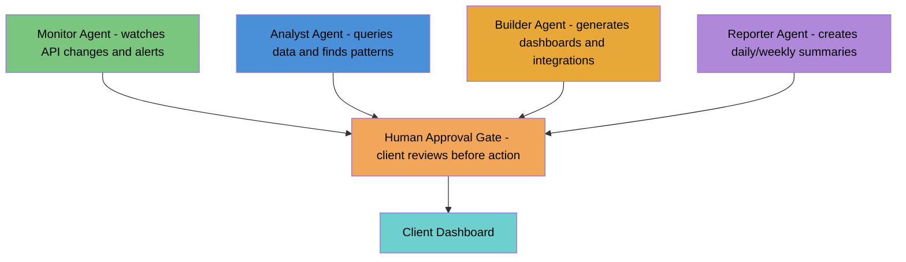

# AI Assessment Service — Business Use Case Plan

## The Business Model

```
AI Consultant offers free/low-cost AI Assessment
    → Captures client's browser activity, software stack, API integrations
    → Analyzes workflows, identifies automation opportunities
    → Delivers: assessment report + working prototype

Upsell: Custom Agentic ESB
    → Shadow organization tailored to client's business
    → PICT-tested API integrations for their actual systems
    → SmartClient dashboards for their team/customers
    → BrowserPod portals for internet-facing services
    → All running on the client's own hardware — data never leaves
```

## Why This Works

The entire value chain runs on infrastructure the client already has — a computer with a browser:

- **Assessment**: Free. Agentidev extension + Ollama (local LLM). No API keys, no cloud, no cost.
- **Consultant's deliverable**: A configured agentidev instance with the client's APIs tested, dashboards built, and agent trained on their workflow.
- **Client's cost**: Electricity. Their computer stays on. Their data stays local.
- **Exposure**: BrowserPod portals (or Cloudflare Tunnel) for internet-facing services when needed.

## Phase 1: The Assessment Workflow

### What the consultant does

1. **Install agentidev** on client's browser (or use the web UI at :9876)
2. **Capture**: Client uses their browser normally for a day/week
   - Semantic memory captures visited sites, workflows, patterns
   - Content scripts capture page structure, forms, API calls
   - Vector DB indexes everything locally (384-dim embeddings)
3. **Analyze**: Agent queries the captured data
   - "What software does this client use?"
   - "What APIs are they calling?"
   - "What are their repetitive workflows?"
   - "Where are they copying data between systems?"
4. **Report**: Agent generates an assessment document
   - Software inventory (from browsing history)
   - API integration map (from captured network patterns)
   - Automation opportunities (repetitive workflows)
   - Recommended integrations (API-to-app candidates)

### What agentidev already provides for this

| Need | Existing Capability |
|------|-------------------|
| Browse capture | Content scripts + semantic memory |
| Software detection | Vector search over browsing history |
| API discovery | Network fetch patterns, OpenAPI spec detection |
| Workflow analysis | Agent with memory_search tool |
| Report generation | Agent with sc_generate (SmartClient dashboard) |

### What's missing

1. **Structured assessment template** — a guided workflow that walks the agent through the analysis
2. **API spec discovery** — auto-detect OpenAPI/Swagger endpoints from captured network activity
3. **Assessment dashboard** — a SmartClient plugin that presents findings visually
4. **Export** — generate a shareable assessment report (PDF or hosted page)

## Phase 2: Build the Client's Integration Layer

### Once the assessment identifies the client's key APIs:

1. **Spec collection**: Fetch OpenAPI specs for each identified API (many SaaS products expose them)
2. **api-to-app pipeline**: For each spec:
   - Generate PICT models → test the API (validate it actually works as documented)
   - Generate SmartClient plugin (fetchUrlAndLoadGrid → eventually RestDataSource)
   - Publish as plugin in the client's agentidev
3. **Custom handlers**: Where the client needs business logic (transform data between systems, apply rules), write bridge handlers
4. **Dashboard composition**: Multi-entity TabSet app combining all the client's integrations into one view

### Example: A Real Estate Agency

Assessment finds:
- Uses Zillow API for listings
- Uses Google Sheets for tracking
- Uses DocuSign for contracts
- Copy-pastes between all three

api-to-app pipeline:
- `pipeline.mjs --spec=zillow-api.json --full-loop` → listings dashboard with search
- Custom handler: pull Google Sheets data via Sheets API
- Custom handler: check DocuSign status via DocuSign API
- Compose: TabSet with Listings | Tracking | Contracts tabs

Result: One browser tab replaces three SaaS windows + manual copy-paste.

## Phase 3: The Shadow Organization

### For clients who need autonomous operation:

The agentic-architecture-plan.md describes AI agent teams with human approval gates. Applied to a client:



Each agent runs on a schedule (bridge cron):
- **Monitor**: Check API endpoints hourly, alert on changes or errors
- **Analyst**: Run PICT tests daily against the client's APIs, track pass rates
- **Builder**: When new API endpoints are detected, auto-generate test suites
- **Reporter**: Weekly summary of API health, automation coverage, savings

The client sees a dashboard with recommendations. They click "Approve" to apply changes. No autonomous writes without human confirmation.

## Phase 4: Internet-Facing Services (BrowserPod Portals)

### When the client needs to expose something to THEIR customers:

Scenario: The real estate agency wants a property search page for buyers.

1. api-to-app pipeline generates a listings search interface
2. A Node.js Express server (generated) handles the search queries
3. BrowserPod runs the Express server in the client's browser
4. Portal URL → public property search page
5. The agency shares the URL with buyers

**Cost**: $0.01/hr when the browser tab is open (~$7.20/mo for 24/7). Zero infrastructure to manage.

**Alternative for always-on**: Cloudflare Tunnel from the client's PC to their Docker container (free, more reliable, no BrowserPod tab needed).

## The Privacy Pitch

This is the killer selling point for small businesses:

> "Your data never leaves your computer. The AI runs locally. The dashboards run in your browser. The integrations call your APIs directly. There's no cloud server, no monthly subscription, no data center with your customer information. It's YOUR computer, YOUR data, YOUR tools."

Compared to competitors:
- Zapier/Make: Cloud-hosted, data passes through their servers, $20-100/mo
- Custom development: $10K+ upfront, needs hosting, ongoing maintenance
- Agentidev: Free software, runs on hardware you already own, data stays local

## Consultant's Service Tiers

| Tier | What | Estimated Price | What Client Gets |
|------|------|----------------|-----------------|
| **Assessment** | 1-day capture + analysis + report | Free or $200 | Assessment PDF, identified opportunities |
| **Integration** | Build 2-3 API integrations + dashboard | $1,000-3,000 | Working agentidev plugins, PICT test coverage |
| **Shadow Org** | Autonomous agents + approval workflow | $3,000-8,000 | Scheduled monitoring, auto-testing, reporting |
| **Portal** | Internet-facing customer tools | $1,000-2,000 | BrowserPod or Cloudflare Tunnel + custom UI |
| **Maintenance** | Monthly check-in, spec evolution tests | $200-500/mo | API test regression, dashboard updates |

## What to Build Next (Priority Order)

### 1. Assessment Plugin (~200 lines)

A SmartClient plugin that guides the assessment:
- Shows browsing history summary (top domains, visit frequency)
- API detection (OpenAPI specs found in captured network traffic)
- Workflow analysis (repeated sequences of actions)
- One-click "Generate Report" using the agent

This is the **lead generation tool**. The consultant installs agentidev, runs the assessment plugin, and has a deliverable to show the client.

### 2. API Spec Auto-Discovery (~150 lines)

Enhance the content capture to detect OpenAPI/Swagger endpoints:
- Look for `/swagger.json`, `/api-docs`, `/openapi.json` in captured URLs
- Parse and index the spec into vector DB
- Flag as "API integration candidate" in the assessment

### 3. RestDataSource Protocol Handler (~200 lines per entity)

Upgrade from fetchUrlAndLoadGrid to proper SmartClient CRUD:
- Bridge handler implements fetch/add/update/remove
- SmartClient grid gets inline editing, add/delete rows
- Generated from OpenAPI spec by the api-to-app pipeline

### 4. BrowserPod Integration (~300 lines)

Phase 1 from the browser-as-esb plan:
- Boot a pod, run generated Express server
- Portal URL accessible from outside
- SmartClient plugin connects to portal URL

### 5. Assessment Report Generator (~150 lines)

Agent tool that produces a structured assessment document:
- Markdown report from vector DB analysis
- Mermaid diagrams of API integration map
- Prioritized automation recommendations
- Export as HTML (shareable via portal or email)

## Success Criteria

The consultant can:
1. Install agentidev on a client's browser in 5 minutes
2. Run a 1-day assessment capture with zero client effort
3. Generate an assessment report with identified APIs and automation opportunities
4. Build working integrations for 2-3 APIs in a day (using api-to-app pipeline)
5. Deliver a multi-tab dashboard with PICT-tested coverage
6. Set up scheduled monitoring (bridge cron + agents)
7. Optionally expose a customer-facing portal via BrowserPod

Total time to first deliverable: **1-2 days** (not weeks).
