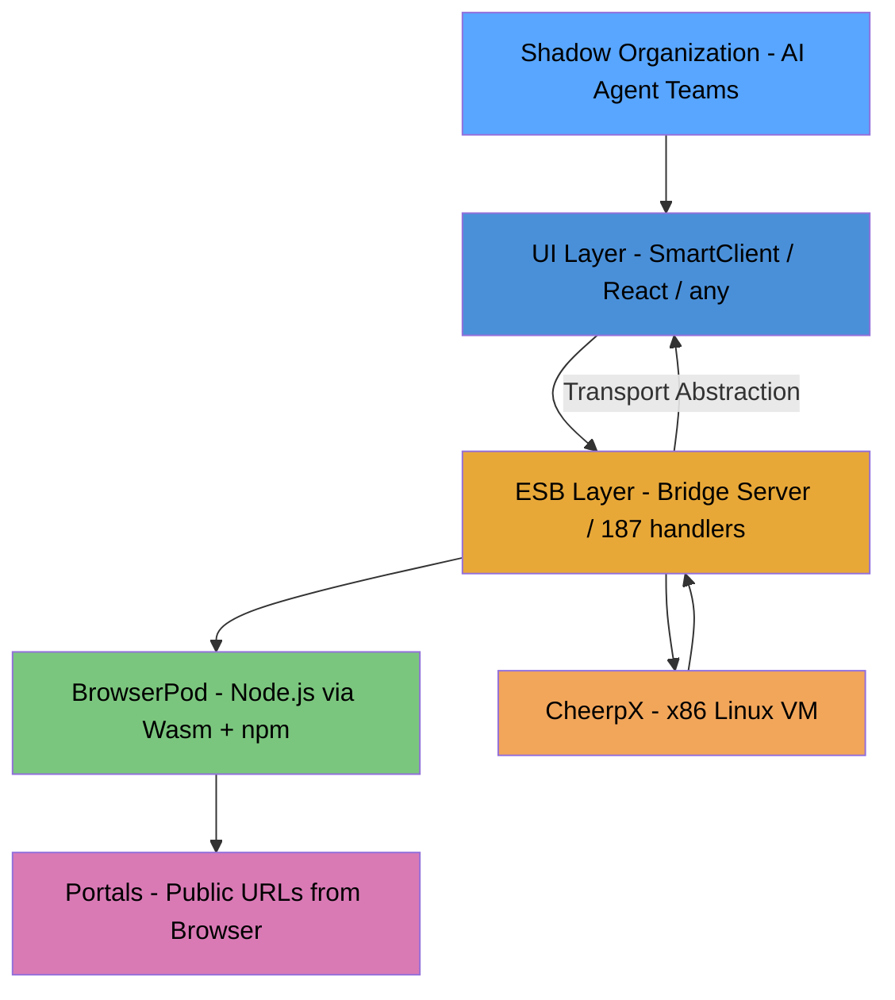
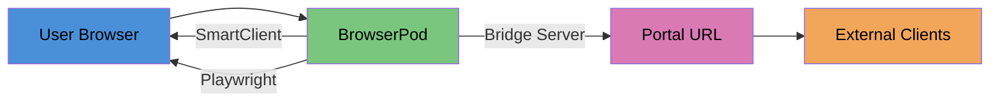

# Browser as ESB: The Convergence Architecture

## The Insight

CheerpX proved that **browser protocols can mirror OS concepts** — syscalls become WebAssembly traps, filesystems become IndexedDB, processes become Web Workers, TCP becomes WebSocket. The browser isn't pretending to be an OS; it implements the same abstractions using different primitives.

Agentidev has done the same thing for **enterprise middleware** without explicitly naming it:

| ESB Concept | Traditional | Agentidev Implementation |
|-------------|------------|-------------------------|
| Service registry | Zato/MuleSoft service catalog | 187 SW handler dispatch table |
| Message routing | Enterprise message bus | chrome.runtime.sendMessage / WebSocket protocol |
| Pub/sub | AMQP/JMS topics | BroadcastChannel + AUTO_BROADCAST_* |
| Service invocation | REST/SOAP channels | fetchUrlAndLoadGrid / fetchAndLoadGrid actions |
| Data binding | ORM + DataSource | SmartClient RestDataSource / IndexedDB proxy |
| Scheduling | Quartz/cron | Croner + bridge scheduler |
| Persistence | Oracle/Postgres | IndexedDB + LanceDB + SQLite (db.mjs) |
| Configuration | YAML/properties | manifest.json + plugin templates |
| Observability | ELK/Splunk | Console buffer + artifact archive + assertions |
| Security | OAuth/RBAC | chrome.identity + host permissions |
| Testing | JUnit/pytest | ScriptClient.assert() + PICT pipeline |
| API generation | OpenAPI codegen | api-to-app pipeline |

**The bridge server IS a Zato replacement.** Not a toy approximation — a working ESB with 187 handlers, WebSocket transport, session management, script execution, cron scheduling, vector search, and AI generation. It happened by accretion, not by design.

## The Three Analogies

```
CheerpX   : OS        :: mirrors syscalls, filesystems, processes
Agentidev : ESB       :: mirrors services, routing, pub/sub, persistence
SmartClient : Enterprise UI :: mirrors DataSources, binding, ORM, forms/grids
```

All three are doing the same fundamental thing: **taking enterprise-class concepts and implementing them using browser-native primitives**. The question is whether they can compose into something greater than the sum.

## The Stack



### Layer 1: Compute (BrowserPod + CheerpX)

**BrowserPod** provides production Node.js with `npm install`, dev servers, and real networking via Portals. **CheerpX** provides x86 Linux for Python, sqlite3, and legacy binaries. Together they give you a full compute substrate that runs in the browser.

**Portals are the missing networking primitive.** CheerpX has filesystems and processes but no outbound networking. BrowserPod has Portals — when a server inside the pod listens on a port, a public URL is created that routes traffic to it. This means:

- An Express API server can run in the browser and be accessible via URL
- A Vite dev server can run in the browser with live preview
- The bridge server itself could run in a BrowserPod

### Layer 2: ESB (Agentidev Bridge Server)

The bridge server already implements the core ESB capabilities:
- **Service registry**: 187 handlers, type-based dispatch, plugin registration
- **Message routing**: WebSocket protocol with request/response matching
- **Channels**: Multiple transports (chrome.runtime, WebSocket, HTTP, BroadcastChannel)
- **Pub/sub**: Broadcast messages to all connected clients
- **Scheduling**: Croner cron with overlap prevention, schedule persistence
- **Persistence**: LanceDB vectors, SQLite runs, IndexedDB via extension
- **Observability**: Console capture, artifact archiving, assertion reporting
- **API validation**: Zod schemas on handler payloads

**What's missing from Zato**: durable queues (at-least-once delivery across crashes), AMQP/JMS adapters, hot deploy (SW lifecycle is the closest analog). These are documented in zato-alt.md as structural browser limitations.

### Layer 3: UI (SmartClient + Transport Abstraction)

SmartClient provides the enterprise UI layer:
- **Declarative configs**: JSON → ListGrid, DynamicForm, TabSet, PortalLayout
- **DataSource binding**: RestDataSource with operationBindings (paid feature area)
- **Actions**: fetchUrlAndLoadGrid, fetchAndLoadGrid, dispatchAndDisplay
- **Renderer**: Whitelist-based component creation, ACTION_MAP wiring

**The transport abstraction makes SmartClient replaceable.** The `transport.js` module dispatches via chrome.runtime OR WebSocket. The handler dispatch table doesn't know or care what UI framework called it. SmartClient is the current rendering target, but the same handlers could serve:
- React (via fetch to bridge HTTP endpoint)
- Vue (same)
- Raw HTML (the web UI at :9876 already does this)
- Native apps (via WebSocket to bridge)

**Critical correction: RestDataSource IS free (LGPL).** The wire protocol (fetch/add/update/remove as JSON over HTTP) ships with the LGPL edition. What's paid is the Java Server Framework that auto-generates the server side from `.ds.xml`. See `plans/smartclient_restdatasource_vs_server_framework.md` for the full analysis.

This means the bridge server (or a BrowserPod Express server) could implement the SmartClient RestDataSource protocol directly — giving SmartClient grids real CRUD (add/update/remove rows, paging, sorting, filtering) without the paid license. The fetchUrlAndLoadGrid action is a stepping stone; RestDataSource binding is the destination.

The gap to fill is server-side: criteria-to-query translation, paging/sort honor, and validation enforcement. The api-to-app pipeline already generates schemas from OpenAPI specs — those same schemas could drive both PICT models AND `.ds.xml` DataSource definitions.

## The Bridge-in-Pod Scenario

This is where it gets interesting. If the bridge server runs inside a BrowserPod:



- **No physical server.** The bridge server (Node.js) runs in a BrowserPod with npm dependencies.
- **Portal URL = WebSocket endpoint.** External clients (other browsers, CLI tools, agents) connect to the portal URL instead of `localhost:9876`.
- **The entire agentidev stack runs client-side.** ESB + UI + compute + AI agent — all in one browser tab.
- **Scaling = opening more browser tabs.** Each tab is an independent agentidev instance with its own bridge, sessions, and agent.

### What this solves

The "exit strategy" problem. The current personal tier requires leaving a PC running. The enterprise tier requires a cloud VM. Bridge-in-pod eliminates both:

- **Personal**: Open agentidev in any browser, anywhere. Your ESB runs in the tab.
- **Enterprise**: Share the portal URL. Others connect to YOUR browser's bridge.
- **Ephemeral**: Close the tab, the pod dies. Open it again, fresh start (or persist via storageKey).

### What this breaks

- **Durability**: Pod dies when the tab closes. No crash recovery. Scheduled jobs stop.
- **Performance**: WebAssembly overhead for the bridge server itself (not just the workloads).
- **Networking**: Portal URLs are temporary and tied to the browser session.

These are solvable: storageKey for persistence, BrowserPod's roadmap includes persistent pods, and the bridge's SQLite database could use OPFS for durable storage.

## The Shadow Organization Connection

The agentic-architecture-plan.md describes autonomous agent teams with human approval gates:

```
Shadow CEO  <-->  Shadow CTO
     |                  |
Shadow CFO  <-->  Shadow PM
```

With the bridge-in-pod model, each agent could run in its own pod:
- Shadow CEO pod: high-level strategy, reads market data via Portals
- Shadow CTO pod: architecture decisions, runs code, generates tests
- Shadow PM pod: project management, tracks tasks, generates reports
- Communication: pod-to-pod via Portal URLs (each agent's bridge is addressable)

The human approval gate is the agentidev sidepanel — the UI layer that presents recommendations and waits for human confirmation before any write action.

## fetchUrlAndLoadGrid as Universal Adapter

The user's instinct is right — `fetchUrlAndLoadGrid` is more powerful than it looks. It's a **universal adapter** between any HTTP API and SmartClient:

```
Any API (REST, GraphQL, RPC)
    ↓ fetchUrlAndLoadGrid
SmartClient ListGrid with dynamic columns
```

It does URL construction (query params or JSON body), response flattening (nested objects → grid columns), dynamic field inference, and error handling — all declaratively from a JSON config. This is what SmartClient's paid RestDataSource does, but without the per-developer license.

Combined with the api-to-app pipeline, this means:
1. Read any OpenAPI spec
2. Generate fetchUrlAndLoadGrid configs for every endpoint
3. Publish as a SmartClient plugin
4. The plugin calls the API directly — no middleware server

This is the **consumer-side** of the ESB. The producer-side is the bridge server (or eventually, a server running in a BrowserPod).

## The RestDataSource Upgrade Path

The progression from current state to full SmartClient CRUD:

```
fetchUrlAndLoadGrid (NOW)
  → One-way: fetch data, display in grid
  → No add/update/delete from the grid
  → Manual form submission for create

RestDataSource (NEXT)
  → Two-way: grid has inline edit, add row, delete row
  → SmartClient manages the CRUD lifecycle automatically
  → Server just needs to speak the protocol (JSON over HTTP)

RestDataSource + Bridge Server (GOAL)
  → Bridge handler implements fetch/add/update/remove
  → .ds.xml drives both client fields AND server validation
  → AdvancedCriteria → query translation
  → Paging, sorting, filtering handled by protocol
```

The RestDataSource wire protocol is documented and simple:

**Fetch request**: `POST /ds/PetDS/fetch` with `{ data: { status: "available" }, startRow: 0, endRow: 75, sortBy: ["-name"] }`

**Fetch response**: `{ response: { status: 0, startRow: 0, endRow: 74, totalRows: 506, data: [...] } }`

**Add request**: `POST /ds/PetDS/add` with `{ data: { name: "Fido", status: "available" } }`

**Add response**: `{ response: { status: 0, data: [{ id: 42, name: "Fido", ... }] } }`

The bridge server already has the handler dispatch pattern. Adding RestDataSource protocol support is a handler per entity that translates the SmartClient wire format to the upstream API (Petstore, or any REST API). This is exactly what the paid Java Server Framework does — but we'd implement it in Node.js.

**The api-to-app pipeline connection**: the spec-analyzer already extracts entity schemas. Those same schemas could generate:
1. PICT models (for testing)
2. SmartClient `.ds.xml` DataSource configs (for the UI)
3. Bridge handlers that speak the RestDataSource protocol (for the server)

One OpenAPI spec → three outputs → full CRUD app with tested API coverage.

## Zato Integration Architecture

### Don't put Zato in the browser. Don't put the bridge in Zato. Let them be peers.

The earlier zato-alt.md explored reimplementing Zato's 12 capabilities in browser JS. But the right answer is simpler: **run real Zato in Docker and let the bridge be the broker between the browser world and the Zato world**.

```
Browser                    Host                      Docker
+--------------+     +---------------+     +-------------------+
| Extension    |---->| Bridge :9876  |---->| Zato Container    |
| SmartClient  |     | (Node.js)     |     | - REST channels   |
| Agent (22)   |     |               |     | - Services (Py)   |
| Sidepanel    |     | 187 handlers  |     | - PostgreSQL      |
+--------------+     | + PICT        |     | - Redis           |
                     | + Sessions    |     | - enmasse.yaml    |
                     +---------------+     +-------------------+
```

### Why two ESBs is not redundant

They handle different concerns:

| Concern | Bridge (frontend ESB) | Zato (backend ESB) |
|---------|----------------------|-------------------|
| UI protocol | SmartClient actions, chrome.runtime | N/A |
| Browser automation | Playwright sessions, CDP | N/A |
| Testing pipeline | PICT, ScriptClient, CDP tests | N/A |
| Agent tools | 22 tools, pi-mono agent loop | N/A |
| Service orchestration | Handler dispatch (basic) | SIO, channels, hot-deploy (full) |
| Database | LanceDB, SQLite (lightweight) | PostgreSQL, Oracle, MSSQL |
| Enterprise adapters | N/A | AMQP, JMS, SOAP, FTP, SAP |
| Caching | In-memory | Redis |
| API composition | fetchUrlAndLoadGrid | Service pipelines, DMI |
| Security | chrome.identity, host permissions | Vault, RBAC, API keys |

**Bridge = browser-to-service.** **Zato = service-to-service, service-to-database.**

### How they connect

The bridge calls Zato via HTTP. No shared container, no installation inside each other. The bridge is a Zato CLIENT:

```javascript
// Bridge handler that proxies to a Zato REST channel
handlers['CUSTOMER_SEARCH'] = async (msg) => {
  const resp = await fetch('http://zato:11223/api/customer/search', {
    method: 'POST',
    headers: { 'Content-Type': 'application/json' },
    body: JSON.stringify({ query: msg.query }),
  });
  return { success: true, data: await resp.json() };
};
```

SmartClient talks to the bridge. The bridge talks to Zato. Zato talks to databases and external APIs. Each layer does what it's good at.

### docker-compose deployment

```yaml
services:
  zato:
    image: zatosource/zato-quickstart
    ports:
      - "11223:11223"  # REST channels
      - "8183:8183"    # Zato dashboard
    volumes:
      - zato-data:/opt/zato
  
  # Bridge runs on the host (not containerized)
  # or optionally:
  bridge:
    build: ./packages/bridge
    ports:
      - "9876:9876"
    environment:
      - ZATO_URL=http://zato:11223
    depends_on:
      - zato

volumes:
  zato-data:
```

Or even simpler: `docker run -p 11223:11223 zatosource/zato-quickstart` and point the existing bridge at it.

### What the agent can do with Zato

The full loop becomes:

1. **Discover**: Agent reads client's API specs (assessment phase)
2. **Generate**: Agent creates a Zato service (Python SIO class) from the spec

```python
# Generated by agent from OpenAPI spec
from zato.server.service import Service

class GetPetByStatus(Service):
    class SimpleIO:
        input_required = ('status',)
        output_optional = ('id', 'name', 'status', 'category')
    
    def handle(self):
        status = self.request.input.status
        response = self.outgoing.plain_http['petstore'].conn.get(
            '/pet/findByStatus', params={'status': status}
        )
        self.response.payload = response.json()
```

3. **Deploy**: Agent generates `enmasse.yaml` and deploys via `zato enmasse`

```yaml
channel_rest:
  - name: /api/pet/find-by-status
    service: petstore.get-pet-by-status
    url_path: /api/pet/find-by-status
    method: GET
```

4. **Test**: api-to-app pipeline generates PICT tests against the new Zato channel
5. **Build UI**: SmartClient dashboard bound to the Zato channel via bridge proxy
6. **Monitor**: Scheduled PICT tests run against Zato channels daily

### Why not Zato in CheerpX

Zato requires PostgreSQL, Redis, Python with hundreds of C-extension packages (gevent, lxml, cryptography, psycopg2, numpy). CheerpX's 600MB rootfs and entropy starvation issues make this impractical. Even a custom disk image would be fragile.

Docker is the right home for Zato. The bridge is the right broker between browser and Docker. HTTP between them is clean and testable.

### When BrowserPod Python support lands

BrowserPod's 2026 roadmap includes Python. When that arrives, a lightweight Zato-like service layer could potentially run in a BrowserPod — not full Zato (no PostgreSQL), but a minimal service framework that speaks the same SIO protocol. Combined with Portals, this would give you service channels accessible from the internet without Docker.

This is a future possibility, not a current plan. For now: Zato in Docker, bridge on host, extension in browser.

## What This Plan Proposes

### Phase 1: BrowserPod Integration (proof of life)

**Goal**: Boot a BrowserPod, run a simple Express server, get a portal URL, load data from it in a SmartClient grid.

- Add BrowserPod SDK to the extension (CDN script or bundled)
- Create a "BrowserPod" runtime in the host-capability interface
- Boot a pod, create a server.js file, run it
- onPortal callback captures the URL
- A SmartClient plugin uses fetchUrlAndLoadGrid with the portal URL

**Exit criteria**: A SmartClient grid displays data from an API running entirely in the browser.

### Phase 2: Bridge-in-Pod Prototype

**Goal**: Run a minimal version of the bridge server inside a BrowserPod.

- Extract the bridge server's core (handler dispatch, WebSocket) into a standalone module
- Boot a pod, install dependencies, run the mini-bridge
- Portal URL becomes the WebSocket endpoint
- Extension connects to the portal URL instead of localhost:9876

**Exit criteria**: The extension's bridge client connects to a bridge server running in a BrowserPod.

### Phase 3: api-to-app with BrowserPod Backend

**Goal**: The api-to-app pipeline generates not just a SmartClient frontend but also an Express API server that runs in a BrowserPod.

- Pipeline generates: server.js (Express API) + client config (SmartClient plugin)
- Server implements the PICT-tested endpoints (mock data from PICT TSV)
- SmartClient plugin connects to the portal URL
- The "app" is fully self-contained: backend + frontend, all in-browser

**Exit criteria**: `--full-loop` produces a working full-stack app with no external dependencies.

### Phase 4: Transport Abstraction for Multiple UI Frameworks

**Goal**: Prove that the bridge's handlers can serve React as easily as SmartClient.

- Create a minimal React app that connects to the bridge via WebSocket
- Same handlers, same protocol, different UI rendering
- Document the adapter pattern for other frameworks

**Exit criteria**: The same api-to-app pipeline generates both SmartClient and React frontends.

### Phase 5: Shadow Organization Pods

**Goal**: Multiple agent pods communicating via Portal URLs.

- Each pod runs a specialized agent (analysis, code gen, testing)
- Agents communicate via HTTP through portal URLs
- Human dashboard (SmartClient) shows agent recommendations
- Approval gate: human clicks "approve" before agents take write actions

**Exit criteria**: Two agent pods collaborate on a task (e.g., one generates code, another tests it) with results visible in the dashboard.

## The Reframing

The user's instinct is exactly right: **agentidev is doing for enterprise middleware what CheerpX does for operating systems**. The browser primitives are different (WebSocket instead of TCP, IndexedDB instead of ext4, Service Worker instead of PID 1) but the abstractions are the same.

The BrowserPod portal is the missing piece that turns this from "a clever browser extension" into "a platform". With portals:
- Services have addressable URLs (ESB endpoint)
- Servers run without servers (serverless literally)
- The bridge is networkable from outside the browser (enterprise integration)
- The shadow organization agents can discover each other (service mesh)

This is Pandora's box, but the lid is already open. The architecture is in place. The question is how fast to turn the crank.

## Open Questions

1. **BrowserPod pricing**: 10 tokens per boot. What's the cost model at scale? Is it viable for always-on bridge-in-pod?
2. **Portal latency**: How much overhead does the portal routing add vs. direct localhost WebSocket?
3. **Portal durability**: What happens to connected clients when the pod restarts?
4. **CheerpX + BrowserPod**: Can they run in the same page? Same browser tab? Do they conflict on threading/memory?
5. **SmartClient RestDataSource protocol**: RESOLVED — RestDataSource IS LGPL/free. The protocol is fully specified (JSON over HTTP). The bridge server can implement it. What's paid is the Java Server Framework that auto-generates the server side. See `plans/smartclient_restdatasource_vs_server_framework.md`.
6. **RestDataSource server implementation**: How much work to make the bridge speak the RestDataSource wire protocol? The protocol handles fetch (with criteria, paging, sort), add, update, remove. Roughly ~200 lines of handler code per entity. The api-to-app pipeline could generate this.
7. **React adapter effort**: How much work to serve React from the same handlers? The web UI at :9876 is already a non-SmartClient client.
8. **Binary uploads and exports**: The LGPL RestDataSource docs explicitly note that binary uploads and format exports (Excel/CSV/PDF) are NOT supported. File uploads need a separate RPCManager.sendRequest path. This is a known gap to design around.
